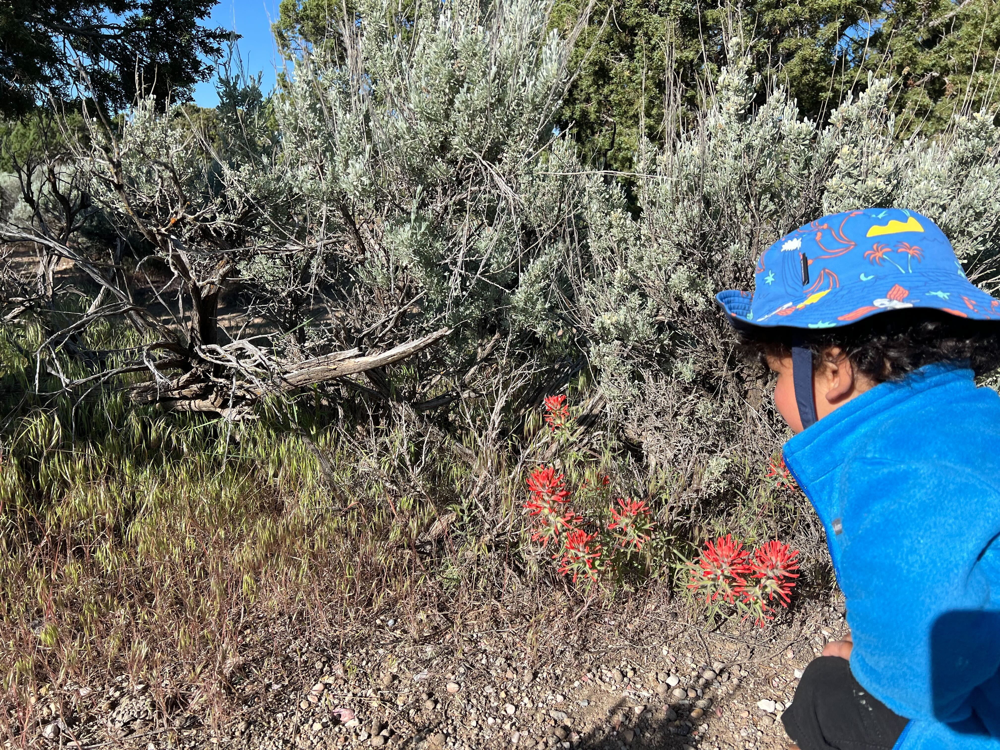

---
# Display name
title: Leo

# Username (this should match the folder name)
authors:
  - Leo

# Is this the primary user of the site?
superuser: false

# Short bio (displayed in user profile at end of posts)
bio: Outdoor enthusiast. 

interests:
  - Vehicles
  - Planets
  - Dinosaurs
  - Mickey Mouse Clubhouse
  - Snacks
  - NOT Naps
  
education:
  courses:
    - course: Learning through Play
      institution: Pre-School
      
# Highlight the author in author lists? (true/false)
highlight_name: false

# Organizational groups that you belong to (for People widget)
#   Set this to `[]` or comment out if you are not using People widget.
user_groups:
  - Affiliated Researchers
---

Leo is an honorary lab member. 
Mostly, he contributes distractions and entertainment, but he also has a curious and observant eye!

Castilleja chromosa</i>, which is parasitizing Great Basin sagebrush, <i>Artemisia tridentata</i>" width="350"/>
<small>Leo inspecting desert paintbrush, <i>Castilleja chromosa</i>, which is parasitizing Great Basin sagebrush, <i>Artemisia tridentata</i>.</small>
