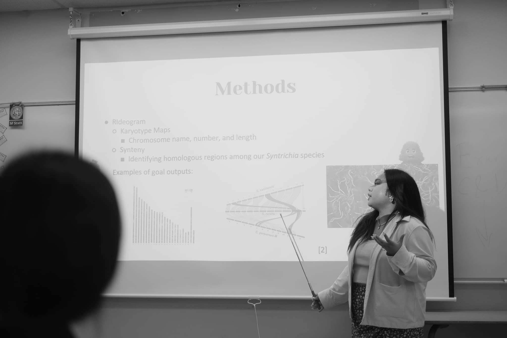

---
# Files in this folder represent a Widget Page

# Display name
title: Nathalie Aquino

# Username (this should match the folder name)
authors:
  - NathalieAquino

# Is this the primary user of the site?
superuser: false

# Short bio (displayed in user profile at end of posts)
bio: Former summer intern. 

interests:
  - Coding
      
# Highlight the author in author lists? (true/false)
highlight_name: false

# Organizational groups that you belong to (for People widget)
#   Set this to `[]` or comment out if you are not using People widget.
user_groups:
  - Lab Alumni
---

## Hi! 

My name is Nathalie and I joined the MEEP Lab in June of 2024 as a participant in the PINC Summer Program. I had the opportunity of working on the project “Identifying Ancestral Sex Chromosomes in the Moss Syntrichia princeps” where we used the R programming language to compare the genome of S. princeps to S. ruralis and S. caninervis. It was so much fun and I’m glad to have been able to meet and work with such amazing and talented people.

I really enjoy doing research and am planning to pursue a PhD and possibly work in the biotech industry. Outside of school, I am really into music. I love learning new songs on the trumpet, piano, and mallet percussion. I also enjoy video games and anime!

<figure>

  
  <figcaption>Nathalie presenting research at the SFSU Summer Symposium. 
</figcaption>
</figure>