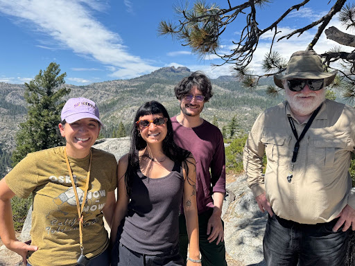
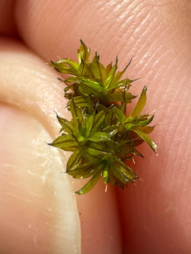
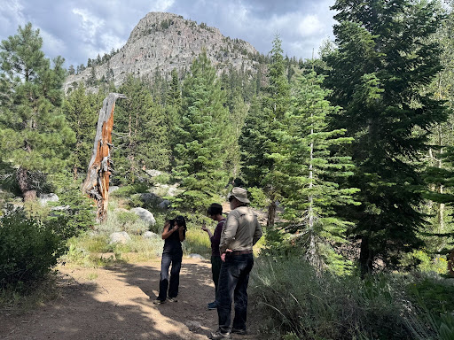

Graduate student [**Michael Collins**](https://meep-lab.com/author/michael-collins/) is studying survival strategies of high-elevation moss. Not that we need an excuse to go on an all-day moss hike, but the project demanded a trip to Stanislaus National Forest to look for a particular <i> Syntrichia <i> moss that thrives in high elevation.

Jenna, Michael, Nio and [Brent Mishler](https://ucjeps.berkeley.edu/people/mishler.html) took a day trip to the Sierra Nevada Mountains to scope out potential research sites for Michael's project; “cold tolerance in high-elevation mosses”. The target species of the day was <i>Syntrichia norvegica,<i> though the crew had fun running into all kinds of moss, lichen, and fungi!

<figure>

  
  <figcaption>Jenna, Nio, Michael and Brent
</figcaption>
</figure>

The first stop was a potential location for [SO BE FREE](https://chapters.cnps.org/bryophyte/sobefree/), which is an annual series of West Coast bryophyte forays. SO BE FREE welcomes all to this four-day outing to enjoy hikes, talks, and keying sessions with microscopes for an enriching bryophyte learning experience. Keep your eye out for the SO BE FREE 31 announcement on their website!

<figure>

  
  <figcaption> <i>Syntrichia Norvegica</i>
</figcaption>
</figure>
<figure>

The crew spent the rest of the day making stops up the mountain to witness the change in kinds of bryophytes elevation increased.

<figure>

  
  <figcaption> Nio looking closely at a moss sample to estimate a field ID
</figcaption>
</figure>
<figure>

Thanks for tuning in to the MEEP blog!
