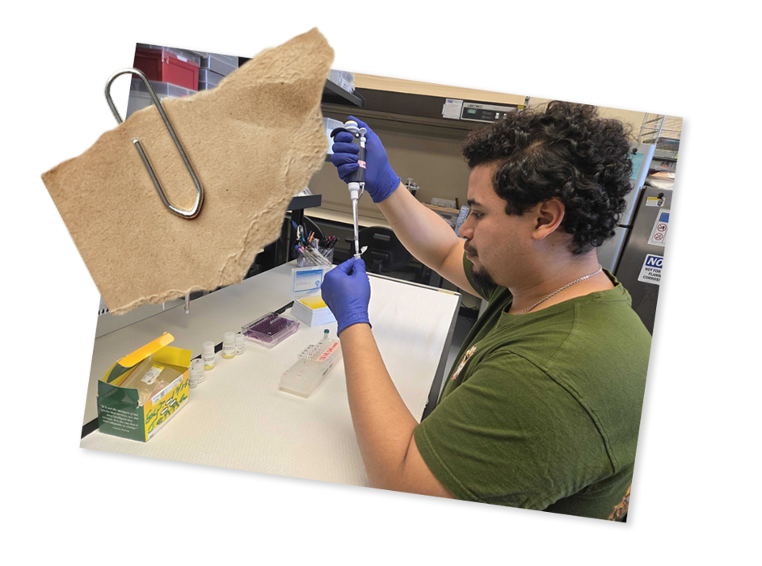
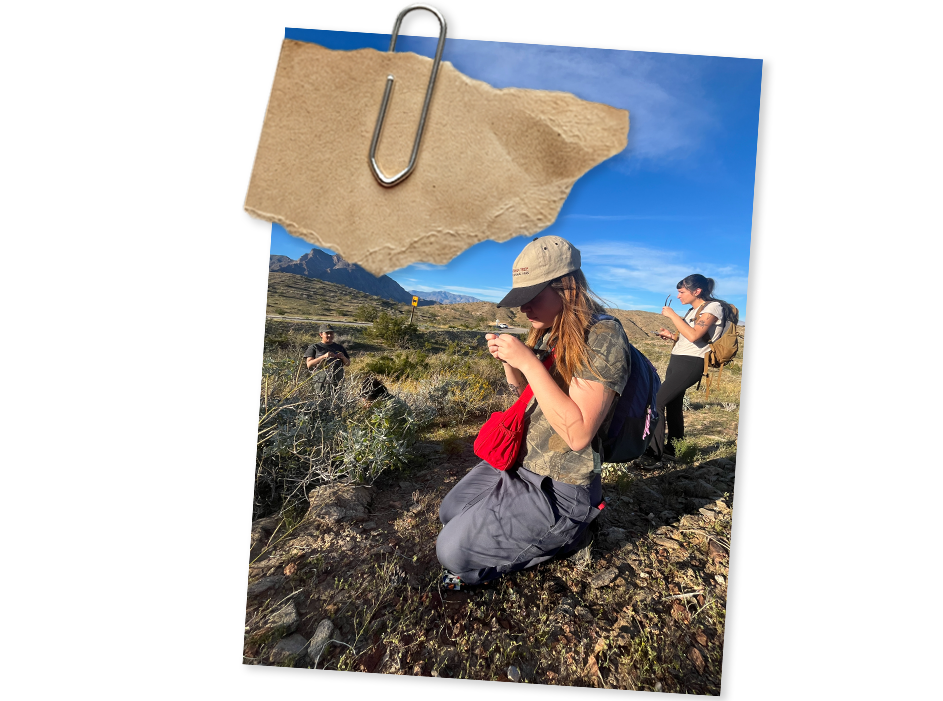

---
# An instance of the Blank widget.
# Documentation: https://wowchemy.com/docs/page-builder/
widget: blank

# This file represents a page section.
headless: true

# Order that this section appears on the page.
weight: 1

title: Join the lab
subtitle:

design:
  columns: '1'
  spacing:
    padding: ['10px', '0', '0px', '0px']
  margin-bottom: -20px

advanced:
  css_class: fullscreen
---

I am happy to speak with students interested in Master’s research in the MEEP Lab. 
Please review one or two of my [**publications**](../publication/) before getting in touch so that we can better discuss your research interests and possible projects.

## Undergraduate Students

Undergraduate research opportunities in the MEEP Lab vary depending on project needs, funding, and available mentoring capacity. 
SFSU students interested in moss ecology, physiology, evolution, genomics, microbiomes, dryland ecosystems, or environmental health are encouraged to apply through SFSU’s [**Biology Undergraduate Research Program (BURP)**](https://biology.sfsu.edu/biology-undergraduate-research-program-burp).

BURP is the best pathway for undergraduates interested in joining the lab for research experience.

## Graduate Students

*Fall 2027*

If you are interested in earning a [**Master of Science in Integrative Biology**](https://biology.sfsu.edu/graduate/integrative) at SFSU in Fall 2027, apply [**here**](https://biology.sfsu.edu/graduate-programs-1) by January 31, 2027.

We may be able to accept 1–2 graduate students to start in Fall 2027. 
Contact [**me**](https://meep-lab.com/author/jenna-t.-b.-ekwealor/) for updates about potential opportunities for graduate students in the MEEP Lab.

Prospective graduate students are also encouraged to look for SFSU Grad Preview events, which typically include information sessions, application workshops, panels with students and faculty, and other resources for applying to graduate programs at SFSU.

 
 

 
