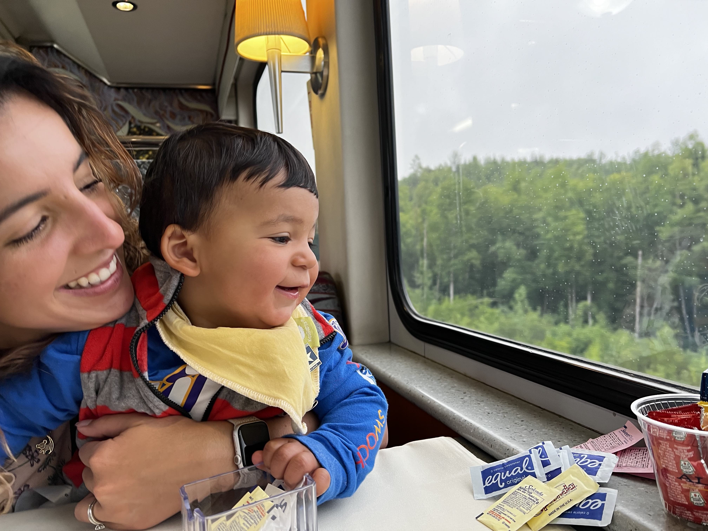
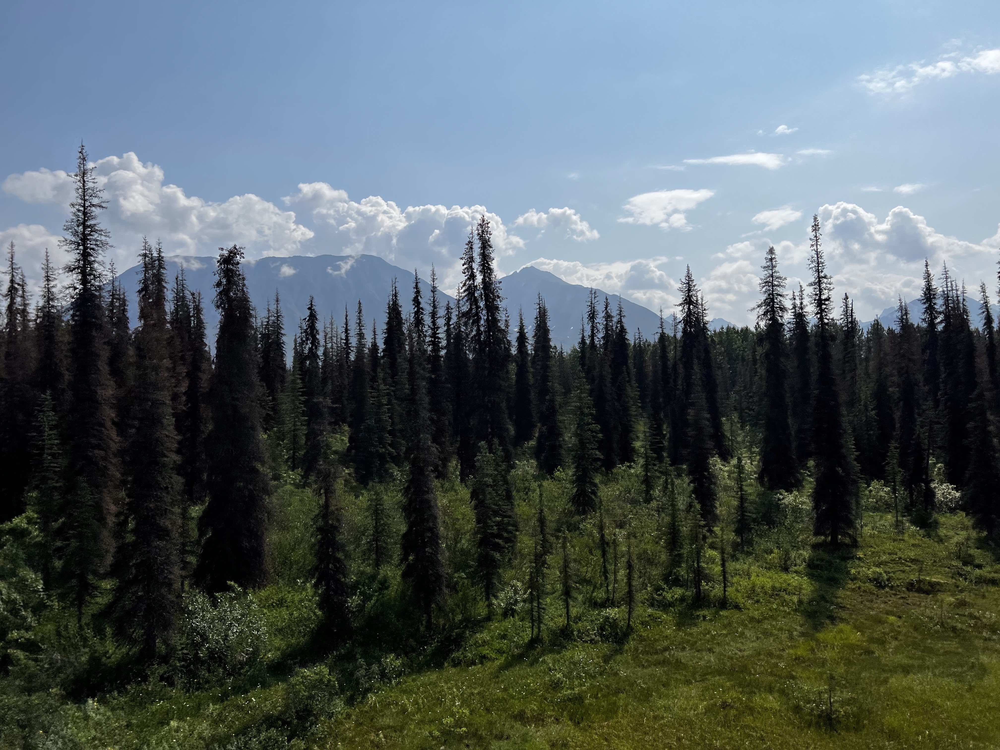
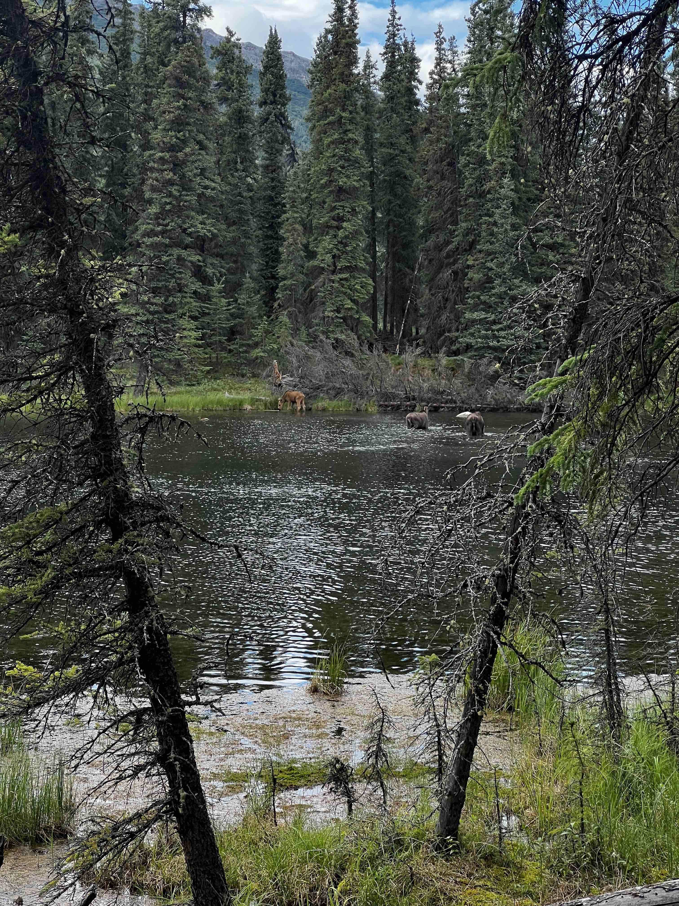
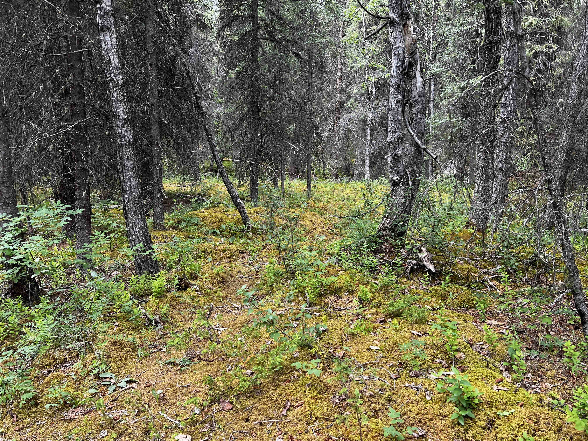
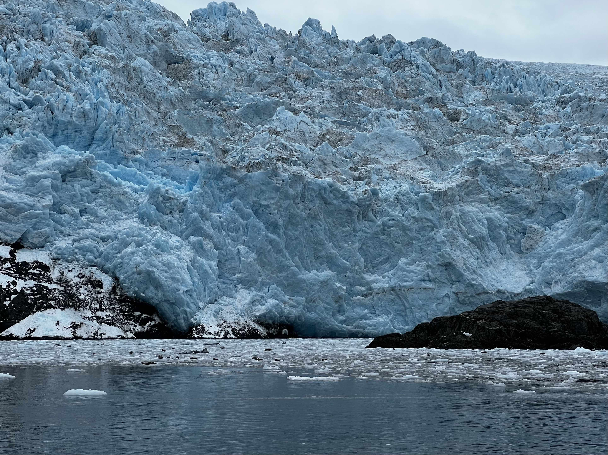
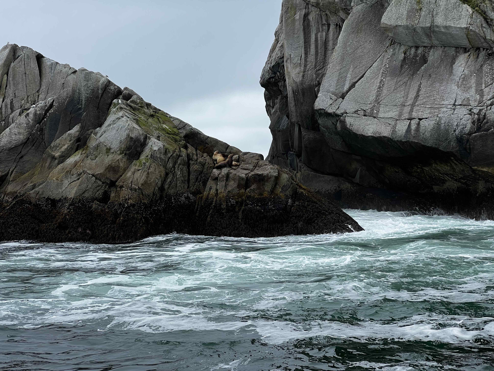
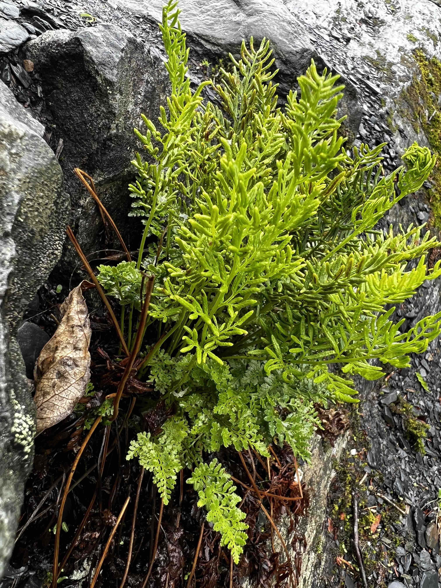
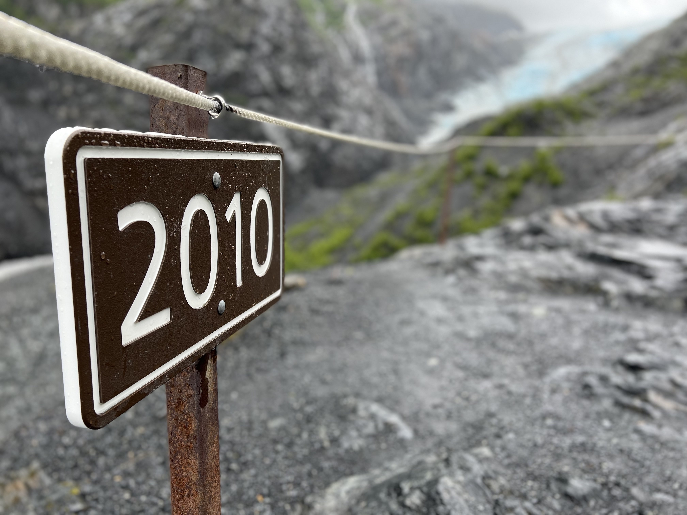

I went to Alaska for two weeks; the first to tour the beautiful state, and the second to co-lead and present in a colloquium in the Botanical Society of America BOTANY 2022 conference. You can see my talk <a href="https://www.jennaekwealor.com/talk/botany2022/" target="_blank">here</a> and more information about the colloquium <a href="https://twitter.com/Bryophyter/status/1548176508618846213?s=20&t=QoIimEjPDisrpTI7kqCPEw" target="_blank">here</a>. 

On the Alaska Railroad with Leo. 

Iconic black spruce, viewed from the Alaska Railroad Denali Star line. 

Hiking with Leo near the Savage River in Denali National Park.

Mother, yearling, and newborn moose in Denali National Park.

Mossy permafrost.

Glacier in Kenai Fjords National Park.

Seals in Kenai Fjords National Park.

Cryptogramma sp.

Glacial retreat. This sign marks the extent of the glacier in 2010. Looking at where the glacial extent in the background (in 2022) shows how much it has retreated in 12 years. 

