Undergraduate MEEP Lab researchers [Ashley](../../content/authors/AshleyMeinke/), NSF REU Scholars [Jason](../../../author/JasonTate/) and [Frey](../../../author/FreyRogers/), and the PINC Genomics Team ([Andre](../../../author/AndreTran/), [Daniel](../../../author/DanielLee/), [Emory](../../../author/EmoryAdelman/), [Nathalie](../../../author/NathalieAquino/), and [Wendy](../../../author/WendyKo/)) gave excellent research presentations at SFSU's Summer Research Symposium. 
Our group's presentations were all back-to-back in the morning; it was a total moss takeover! It was *awesome.*

Congratulations, all!

    <a href="receiving_pointers.jpeg" target="_blank">
        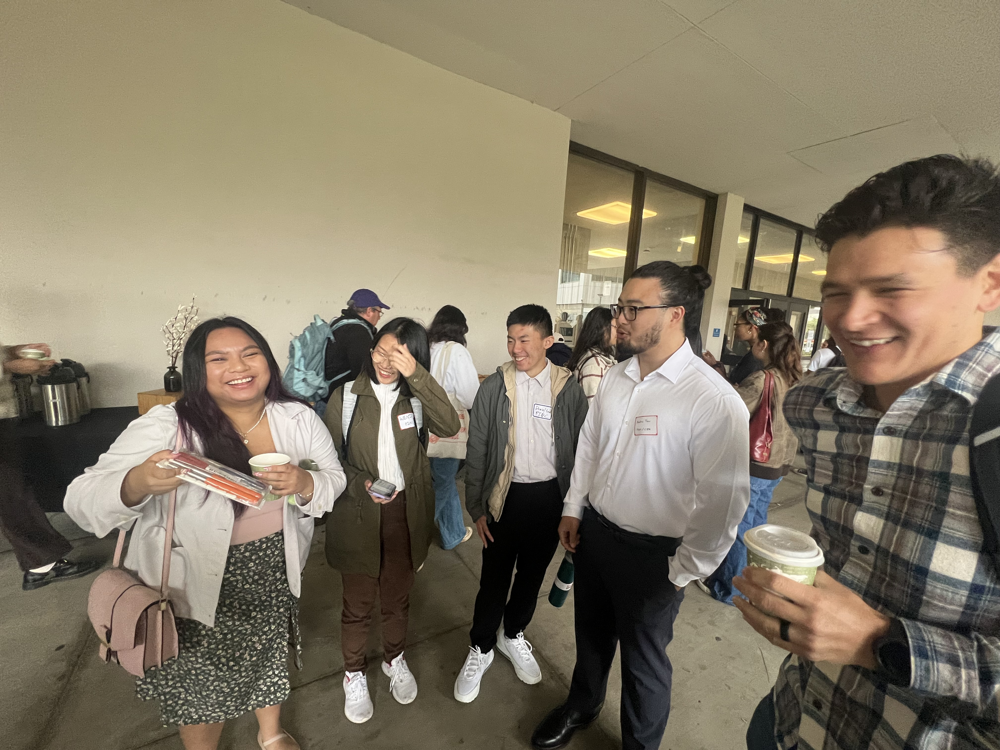
    </a>
    <a href="Emory.jpeg" target="_blank">
        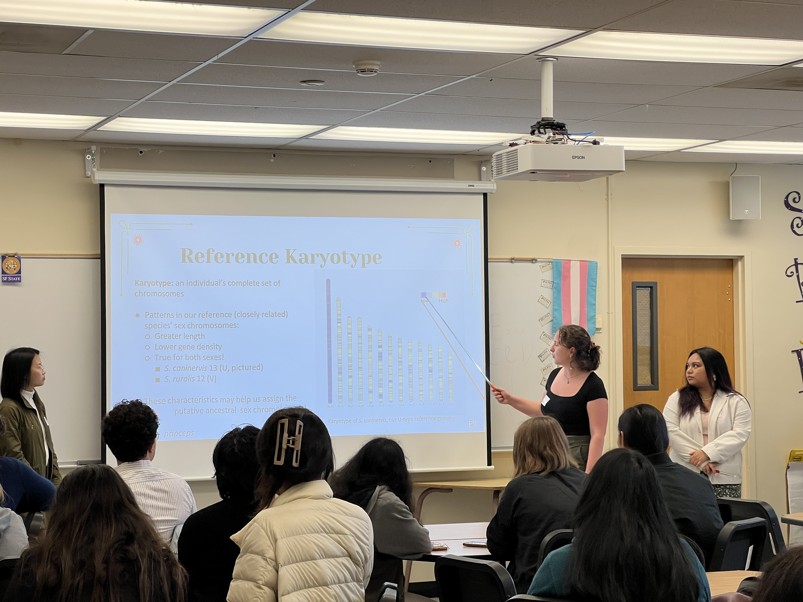
    </a>
    
    <a href="Andre.jpeg" target="_blank">
        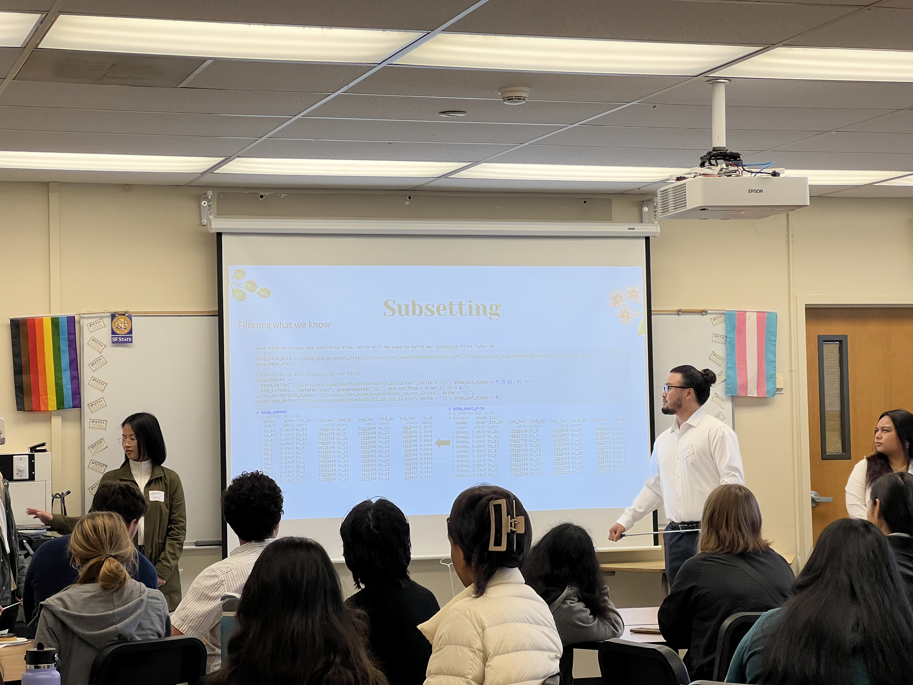
    </a>
    <a href="Daniel.jpeg" target="_blank">
        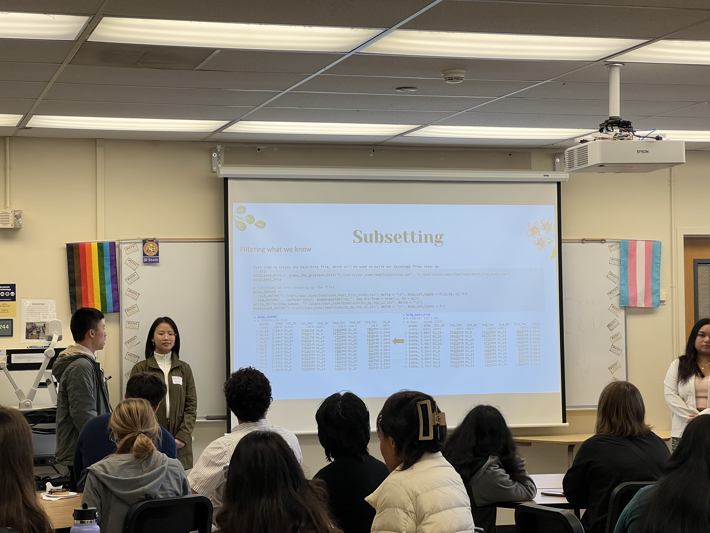
    </a>
    <a href="Genomics_PINC.jpg" target="_blank">
        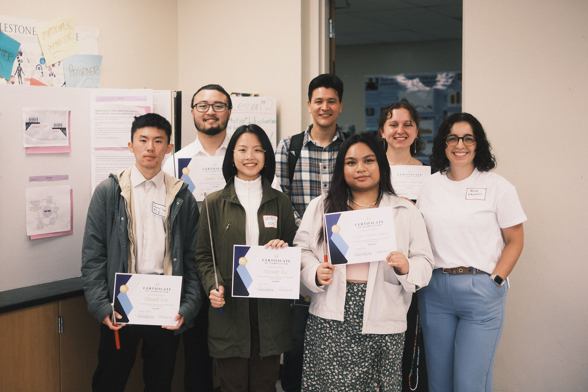
    </a>
    <a href="Genomics_PINC_fun.jpg" target="_blank">
        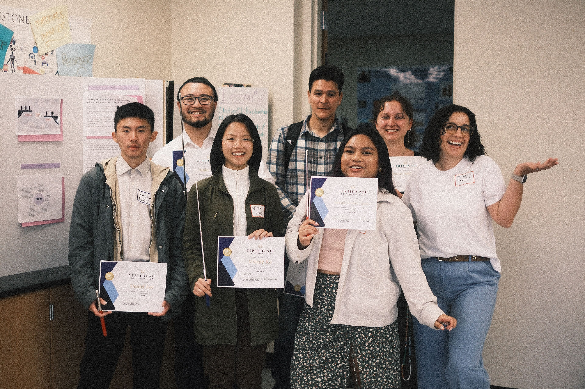
    </a>
    <a href="Ashley_PINC.jpeg" target="_blank">
        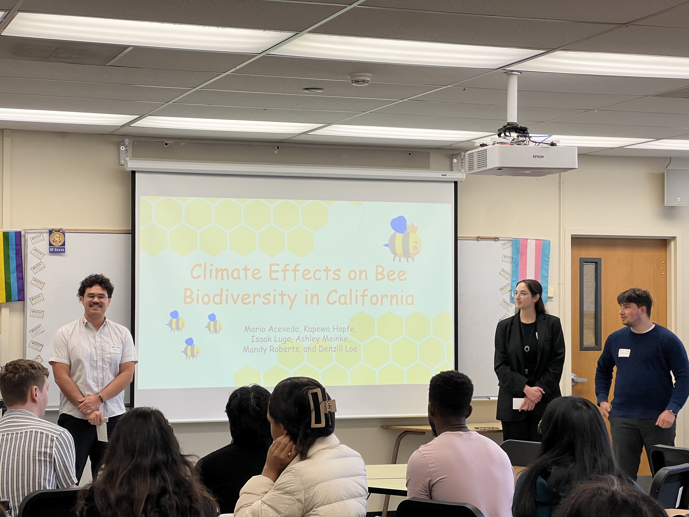
    </a>
    <a href="Jason.JPG" target="_blank">
        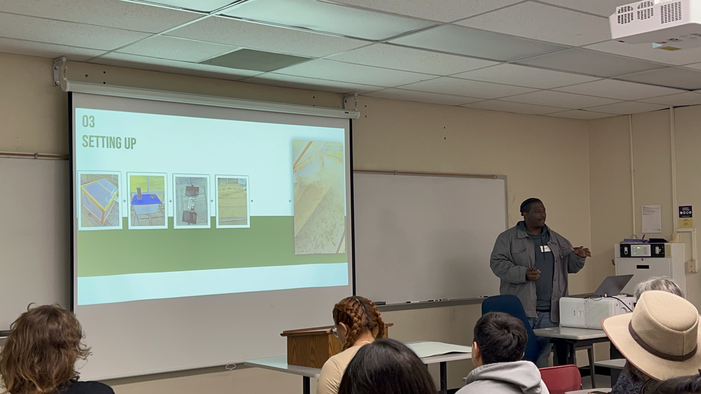
    </a>
    <a href="Frey.JPG" target="_blank">
        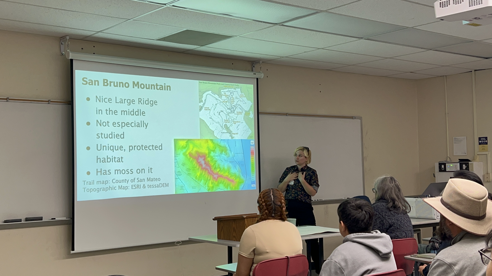
    </a>
    <a href="Ashley.JPG" target="_blank">
        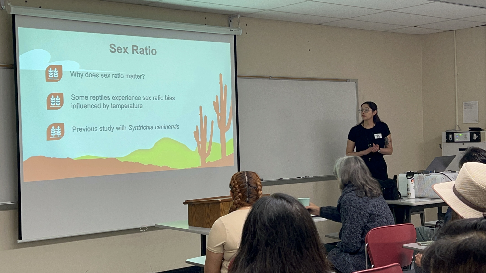
    </a>
    <a href="after.jpeg" target="_blank">
        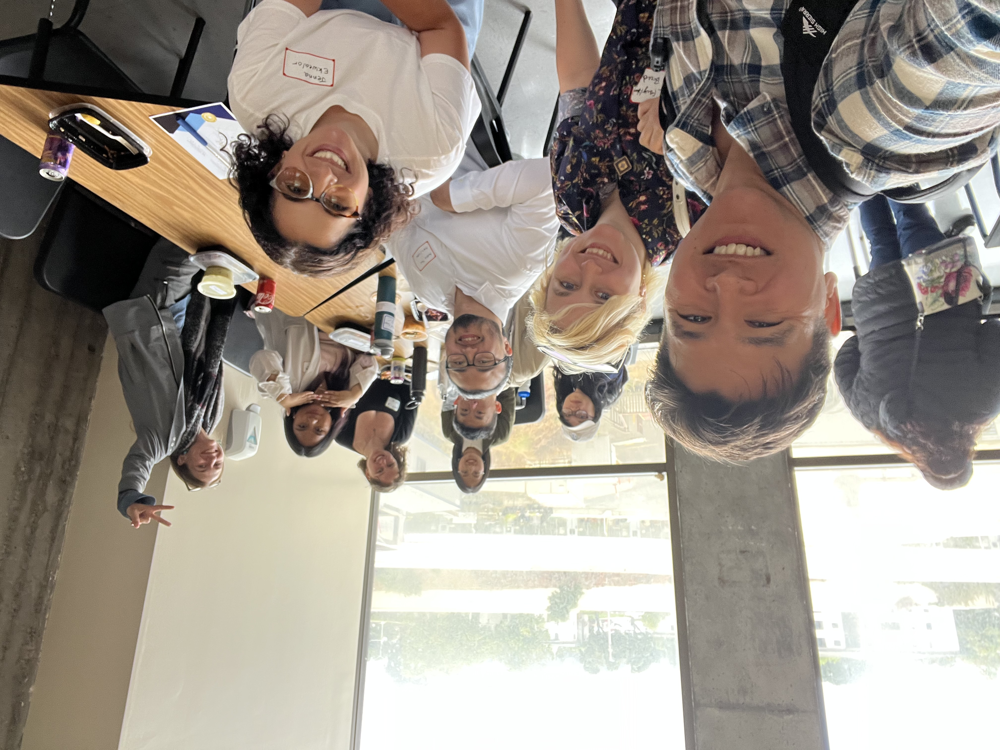
    </a>

