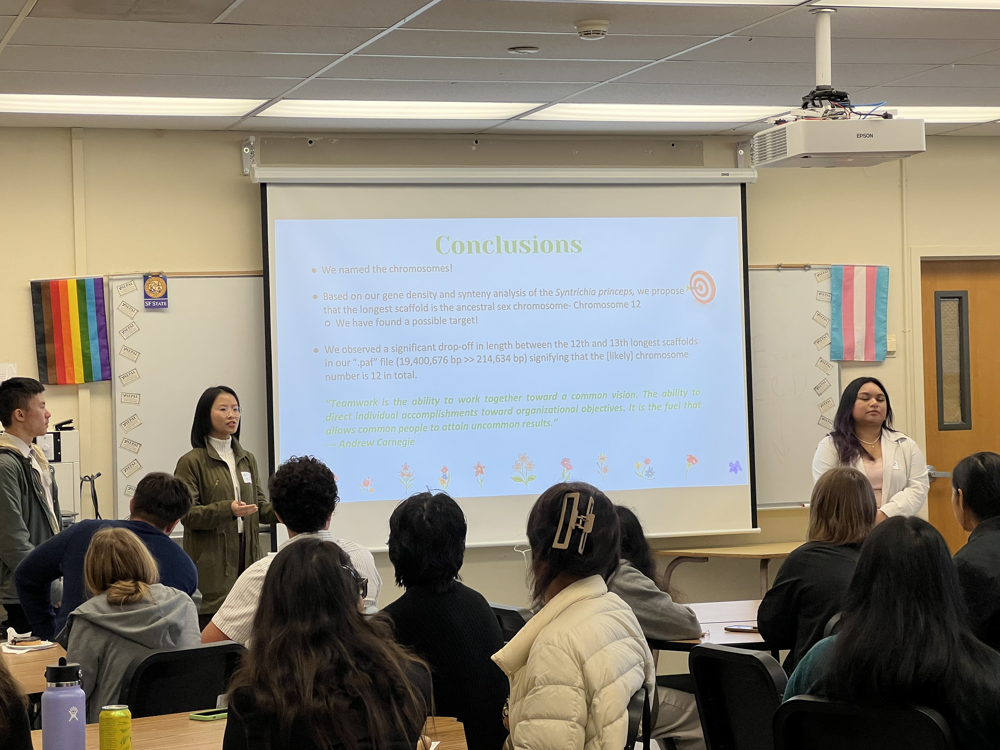

Undergraduate MEEP Lab researchers [Ashley](../../content/authors/AshleyMeinke/), NSF REU Scholars [Jason](../../../author/JasonTate/) and [Frey](../../../author/FreyRogers/), and the PINC Genomics Team ([Andre](../../../author/AndreTran/), [Daniel](../../../author/DanielLee/), [Emory](../../../author/EmoryAdelman/), [Nathalie](../../../author/NathalieAquino/), and [Wendy](../../../author/WendyKo/)) gave excellent research presentations at SFSU's Summer Research Symposium. 
Our group's presentations were all back-to-back in the morning; it was a total moss takeover! It was *awesome.*

Congratulations, all!

  
  
The members of the PINC Genomics receiving their pointer gift from Mentor Richard

  
  
Emory presenting with a pointer

  
  
Wendy presenting

  
  
Andre presenting

  
  
Daniel presenting

  
  
The members of the PINC Genomics team smiling with their certificates

  
  
The members of the PINC Genomics team doing silly poses with their certificates

  
  
Ashley presenting with her PINC group

  
  
Jason presenting

  
  
Frey presenting

  
  
Ashley presenting

  
  
Some MEEP Lab members enjoying lunch after the symposium

