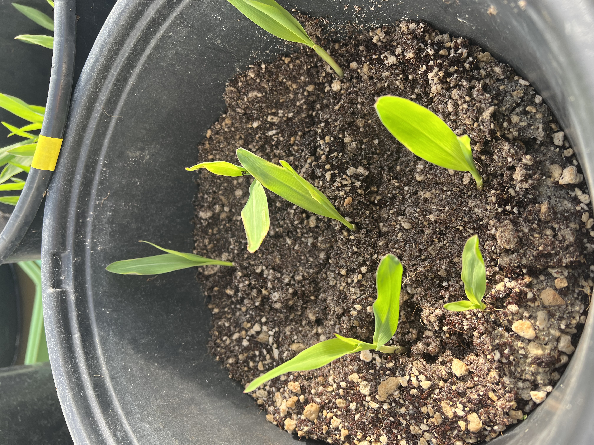
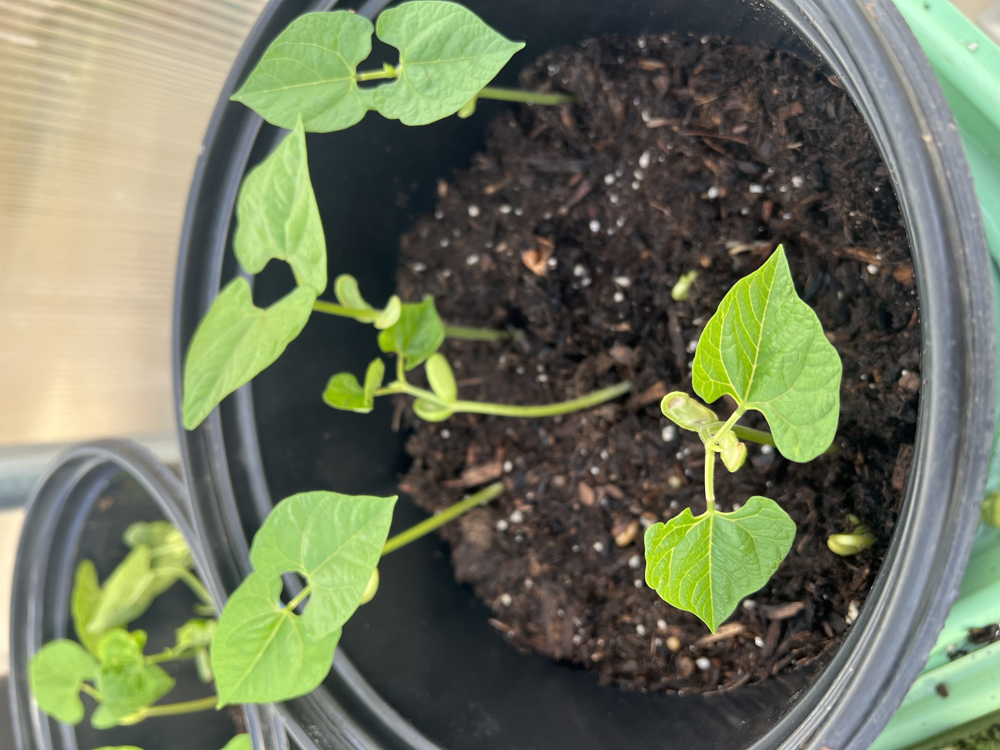
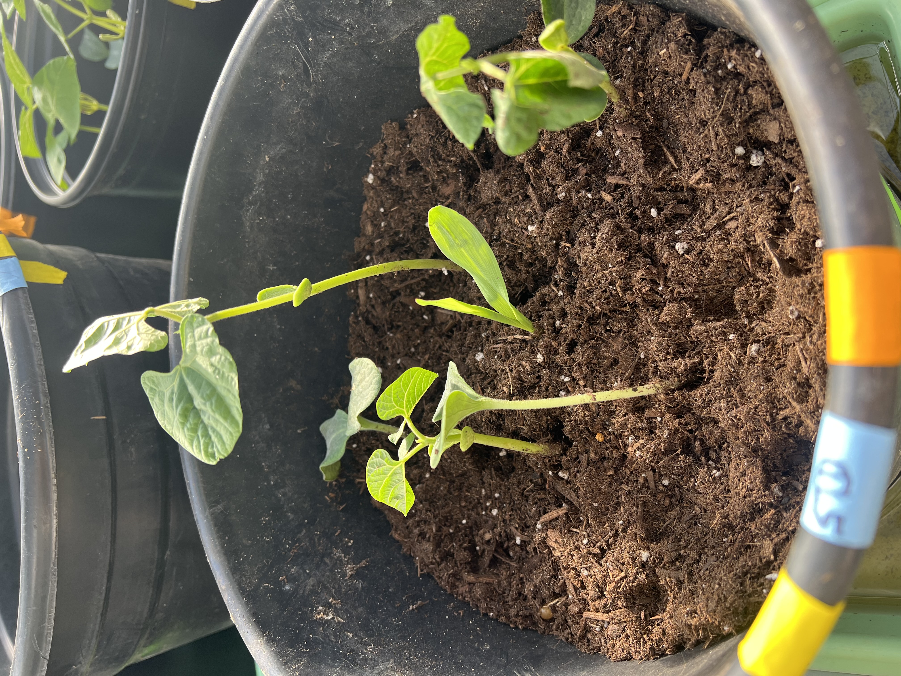
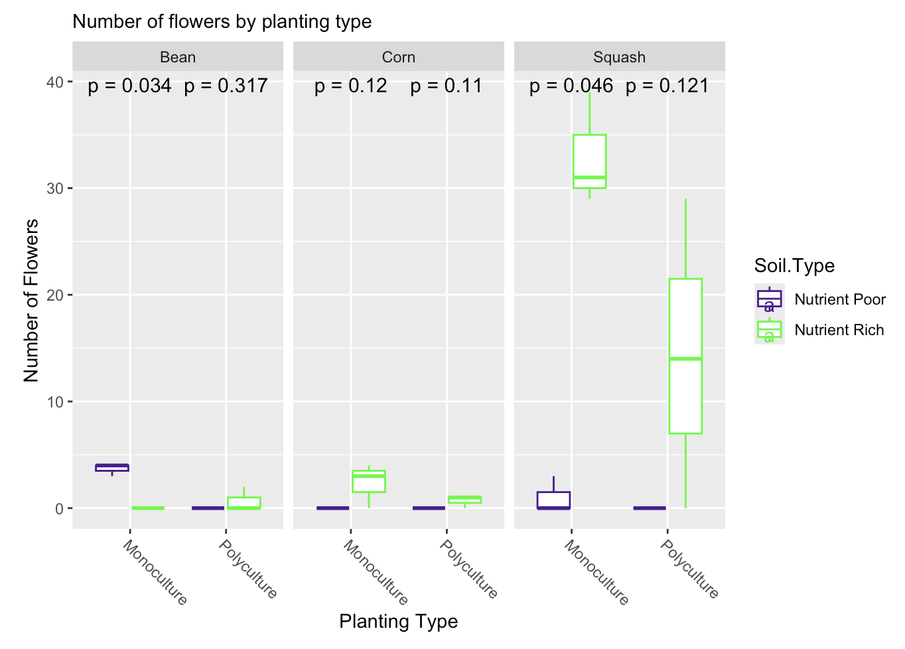
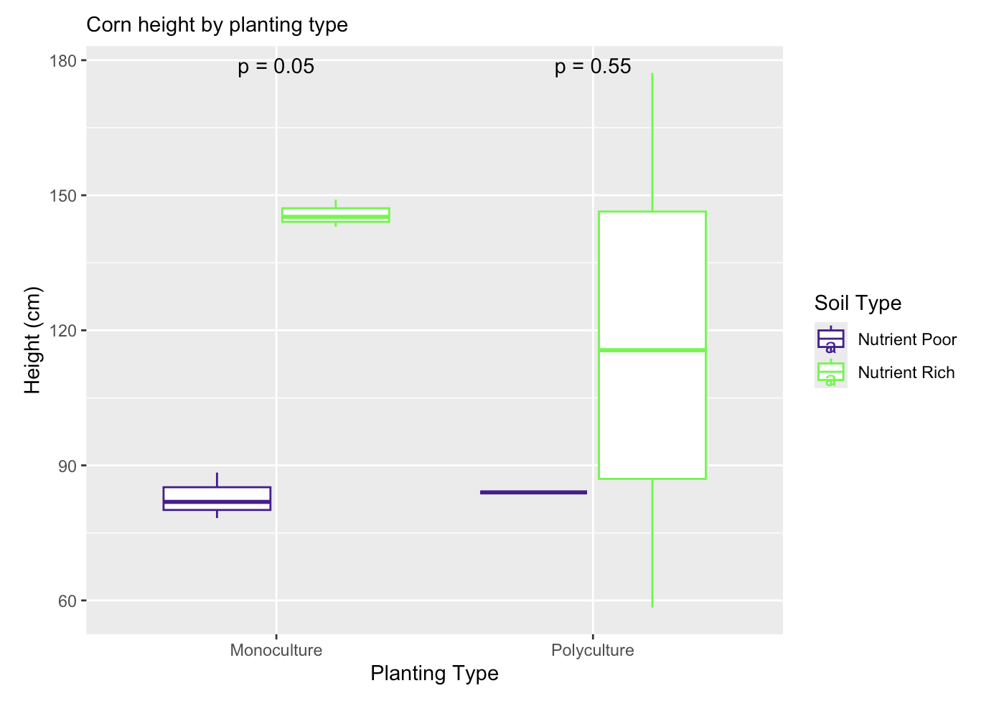
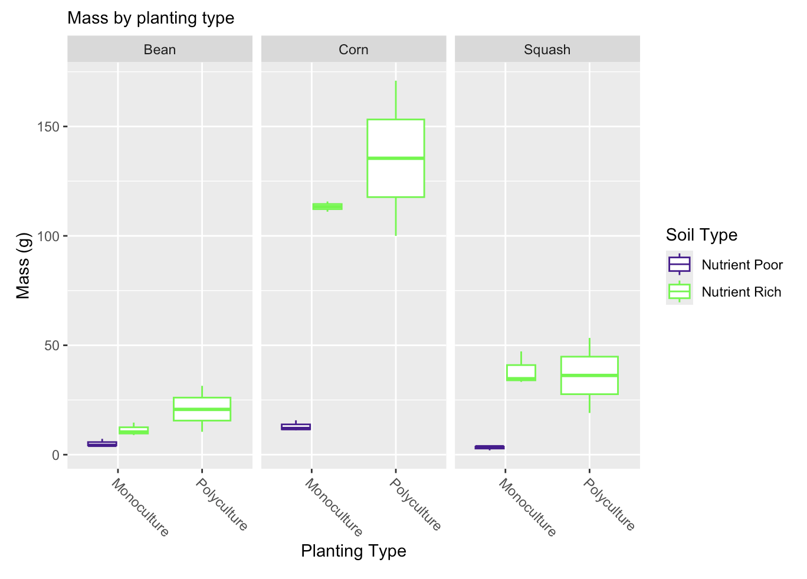

### In our Plant Ecology course this semester, we didn’t just study plants, we studied relationships.
Between plants and environment. 
Between species. 
Between people and land. 
Between traditional ecological knowledge and modern science. 
At the heart of it all was a semester-long, class-wide experiment rooted in one of the most enduring examples of sustainable agriculture: the Three Sisters (corn, beans, and squash grown together in polyculture). This planting system is more than efficient agriculture, it’s a story of facilitation passed down through generations of Indigenous peoples across the Americas. We explored it not only through greenhouse experiments and data collection but through engagement with traditional ecological knowledge (TEK) that is place-based, relational, and rooted in observation and respect.

<figure>

  
  <figcaption>A Three Sisters experimental pot.  
</figcaption>
</figure>

### Bringing TEK into the Classroom
Since the first day of class, I have tried to make it clear that this wasn’t a course about plants in isolation, but about plants as part of ecological and cultural systems, and that humans are and always have been a part of both. Throughout the semester, we read and discussed *Braiding Sweetgrass* by Robin Wall Kimmerer. Kimmerer, a plant ecologist and Citizen of Potawatomi Nation, bridges Western science and Indigenous knowledge with humility and insight. Her chapter on the Three Sisters became a cornerstone for our class. She writes not only about the biological facilitation of one another (corn offering structure, beans fixing nitrogen, squash shielding the soil), but also about their moral teachings: interdependence, generosity, and community. 

### The Experiment: Monocultures vs. Polycultures
We asked: How does planting the Three Sisters together compare to growing each crop alone? What happens when we swap in different species of legumes; do they change the outcomes for corn and squash? And how do these relationships play out in different environmental contexts? 

<figure>

  
  <figcaption>Corn seedlings in monoculture. 
</figcaption>
</figure>

<figure>

  
  <figcaption>Bean seedlings in monoculture. 
</figcaption>
</figure>

<figure>

  
  <figcaption>Squash seedlings in monoculture. 
</figcaption>
</figure>

<figure>

  
  <figcaption>Three Sisters seedlings in polyculture. 
</figcaption>
</figure>

To explore these questions, we grew our crops in both nutrient-rich and nutrient-poor soils, hypothesizing that the polyculture would be especially necessary in the nutrient-poor treatment. We expected that the Three Sisters, with their complementary roles and particularly the nitrogen-fixation provided by legumes/legume symbionts, would perform better together in low-nutrient conditions than they would alone in the same conditions. 

Throughout the semester, we observed plant height and flower/fruit production, and also measured height and wet biomass at the final harvest. The design was also a collaborative effort, with all students contributing to and analyzing a shared dataset.

### What We Learned (Beyond the Data)
We measured biomass, fruit yield, and growth rates, but the biggest lessons were not about our particular results. We explored how facilitation and resource partitioning can lead to higher productivity in polycultures and how TEK systems like the Three Sisters reflect ecological principles long before they had names in Western science. Perhaps most importantly, we talked about what it means to honor TEK in academic spaces: not by appropriating, but by listening, acknowledging, and learning. *Braiding Sweetgrass* helped us think critically about what science gains when we make space for different ways of knowing. It reminded us that scientific inquiry doesn’t have to be extractive (and perhaps should not be), it can be a gift in return.

<figure>

  
  <figcaption>Students counting and measuring plants.
</figcaption>
</figure>

### Main Results
Soil nutrient level had a significant effect on plant performance across all treatments and combinations. Nutrient-poor soil consistently reduced yield: plants were shorter, lighter, and produced fewer flowers and fruits, regardless of whether they were in monoculture or polyculture. 

<figure>

  
  <figcaption>Squash in nutrient-rich soil (top left) and nutrient-poor soil (bottom right), demonstrating the marked difference in yield. 
</figcaption>
</figure>

<figure>

  
  <figcaption>Number of flowers by planting type.
</figcaption>
</figure>

Interestingly, we found that while corn grew taller in monoculture, the mass per shoot was higher in polyculture, suggesting more efficient biomass production when grown with companions. Pole bean mass was also higher in polyculture, further supporting our hypothesis that plant partnerships can boost performance, possibly through facilitation and nitrogen sharing. 

<figure>

  
  <figcaption>Corn height by planting type.
</figcaption>
</figure>

Unfortunately, we were unable to analyze shoot mass for polyculture plants in nutrient-poor soil, as the data for this treatment combination was never uploaded to the shared spreadsheet, despite the fact that the plants were harvested and measured. This limited our ability to fully evaluate one of the most important conditions in our experimental design.

<figure>

  
  <figcaption>Mass by planting type.
</figcaption>
</figure>

We also made several observations that sparked questions and hypotheses. Early in the experiment, monocultures (specially corn) appeared to do better in terms of initial height and vigor. This early advantage seemed to wane over time. We wondered whether there might be a benefit to germinating around members of the same species, particularly for corn, where monocultures seemed to gain physical stability from neighboring stalks. Their roots appeared to intertwine and hold each other up, especially in the taller monoculture pots. This led to broader questions about how seedling roots might behave—intertwining, avoiding, or supporting—depending on the species mix. Moreover, this observation made us wonder whether benefits of polyculture may play out more in a longer-term experiment. 

Another striking observation came from our backup plants, which we eventually culled for space. When we uprooted them, we noticed a difference in root architecture by soil type. In nutrient-poor soil, especially for corn roots, were long, thin, and exploratory, as if searching for nutrients. In nutrient-rich soil, roots were much shorter and more compact, forming dense upside-down shrubs just beneath the surface. Though we didn’t measure these traits, they offered visual cues about how soil resources might shape plant behavior below ground.

<figure>

  
  <figcaption>Corn seedling from nutrient-rich (left) and nutrient-poor (right) soils, demonstrating difference in root architecture. 
</figcaption>
</figure>

### Course-Level Takeaways
One unexpected but valuable takeaway had less to do with the plants and more to do with the logistics of collaboration. During the final harvest, we discovered that not only were sample sizes reduced, but entire treatment combinations were effectively lost due to missing data. Although the measurements were taken for polyculture plants grown in nutrient-poor soil, for example, the persons responsible for recording those data never uploaded it, and we had no way of identifying who worked with those pots. 

<figure>

  
  <figcaption>Graduate Student Teaching Assistant Richard proudly presenting a particularly fruitful corn stalk.
</figcaption>
</figure>

<figure>

  
  <figcaption>A tiny ear of corn from one of our experimental plants.
</figcaption>
</figure>

In future semesters, I plan to assign pots directly to individual students and require real-time data entry or direct upload to prevent these kinds of gaps. Overall, we need to establish a lot clearer protocols and ensure that the same people are performing the same measurements across treatment types to have more reliable results. This experience became a good teaching moment, not just about ecological research, but about accountability, communication, and the structure of collaborative work in science.

### Looking Forward
As climate change continues to put strain on our ecosystems and agricultural systems, there is growing recognition that TEK offers insights for sustainable land management and resilience. Our experiment was a small-scale attempt to understand that wisdom not only through scientific methods, but through relationship with plants and with the teachings that have long sustained the land. The Three Sisters were our curriculum, our collaborators, and our teachers. And they reminded us, as Kimmerer says, that “all flourishing is mutual.”

### See It in Action
The photos in the album below are from a single afternoon late in the semester, shortly before harvest day, and are courtesy of San Francisco State University Strategic Marketing and Communications.



 

