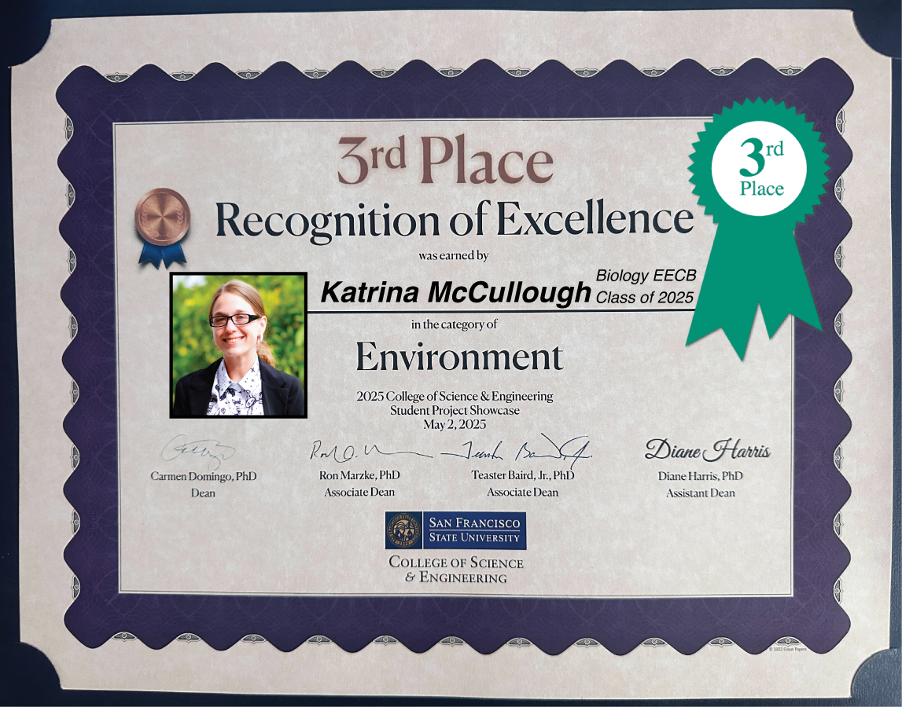

Senior MEEP Lab researcher and LSAMP scholar [Katrina McCullough](../../../author/KatrinaMccullough/) presented her research project "*Lichens of San Bruno Mountain: Distribution, morphology, and reproductive strategies of epiphytic lichens on* Baccharis pilularis" at the 2025 SFSU CoSE Student Project Showcase.  

This is a major campus-wide event featuring over 200 posters from departments including Biology, Chemistry & Biochemistry, Computer Science, Engineering, Earth & Climate Sciences, Mathematics, Physics & Astronomy, and Psychology. 
Posters are judged within topic-based categories, and Katrina presented in the Environment category.

Each category awards 1st, 2nd, and 3rd place prizes. 
Posters are evaluated by faculty and industry volunteer judges based on clarity, design, presentation, and research significance. 
Katrina won **3rd place**!

Her project focuses on the ecology of epiphytic lichens on coyote brush (*Baccharis pilularis*) at San Bruno Mountain, looking at species distribution, morphology, and reproductive strategies across microhabitats.

Congratulations, Katrina!

MEEP Lab senior **Emory Adelman** also presented a poster based on a class research project. 
In addition, **former MEEP Lab undergrads** from the [2024 PSP summer research group](../../../post/2024-07-27-summer2024/) presented new work from other classes and labs. 
It was great to see so many familiar faces and projects throughout the showcase.

Stop by Hensill Hall 4th floor case (outside of the lab in HH 405) to see the poster for yourself.

<figure>

  
  <figcaption>Katrina presenting her research at the CoSE Student Project Showcase.
</figcaption>
</figure>

<figure>

  
  <figcaption>Click to enlarge the poster!
</figcaption>
</figure>

<figure>

  
  <figcaption>Katrina won 3rd place in the Environment category!
</figcaption>
</figure>
