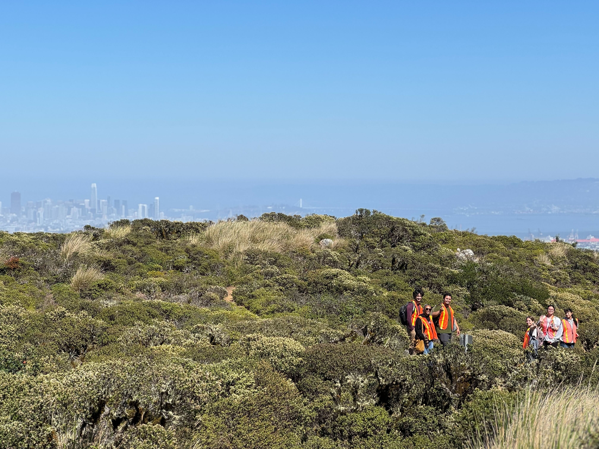

The MEEP lab has seen some serious growth in August 2025, we have seven new members to welcome! **Kanika**, **Michael**, **Kelley**, **Paris** and **Joshua** are first year grad students, **Abbey** is a post-baccalaureate scholar with the NSF Bay Area RaMP for Microbiome Sciences, and **Nio** is an undergrad at SFSU. Read below about what our new researchers are up to!

Paris and Kanika are tackling a project investigating desiccation tolerance of mosses in California Deserts. Paris studied biology at UCSC and Kanika got her BS in Forensic Science from San Jose State. 

Abbey is teaming up with Nio and MEEP veteran Kaylee Macomb to work on a project researching the lichens of San Bruno Mountain. Abbey is from Texas and studied Ecology at UNT and Nio is studying ecology, evolution and conservation biology at SFSU.

Michael is diving into a genomics project looking at high elevation Syntrichia, and he received his BS in bioinformatics at UCSC. 

Joshua and Kelley are tackling the dust project which investigates dust and environmental health in the Central Valley. Kelley and Joshua both graduated from SFSU, Joshua with a BS in biology and Kelley with a BS in ecology, evolution and conservation biology. 

The new MEEP team enjoyed a field trip to San Bruno Mountain last week! 

<figure>

  
  <figcaption>Michael, Kelley, Joshua, Kat, Kaylee and Nio on San Bruno Mountain!  
</figcaption>
</figure>

A warm welcome to all of our new members, and stay tuned for updates on their research!

