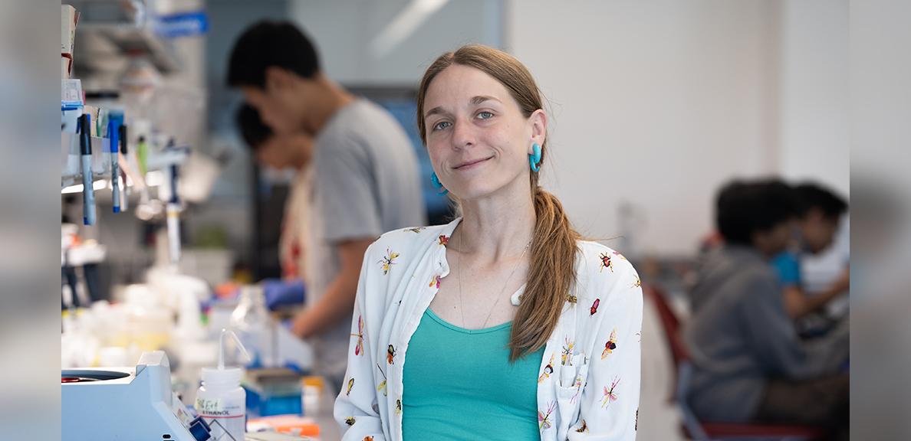

MEEP Lab alumnus, [**Katrina McCollough**](https://meep-lab.com/author/katrina-mccullough/) has earned the title of CSU Trustee Sam Nejabat Scholar for Cal State East Bay. The MEEP lab wants to congratulate Kat on her well-deserved achievement!!!

[**Read about Kat on the CSU East Bay announcement page;**](https://www.csueastbay.edu/news-center/2025/09/from-illustrator-to-ecologist-katrina-mccollough-named-2025-csu-trustee-scholar.html) this fantastic write-up details Kat's journey as an ecologist and mycology icon.

<figure>

  
  <figcaption>
</figcaption>
</figure>

The MEEP lab is proud to celebrate Kat, congratulations!!!
