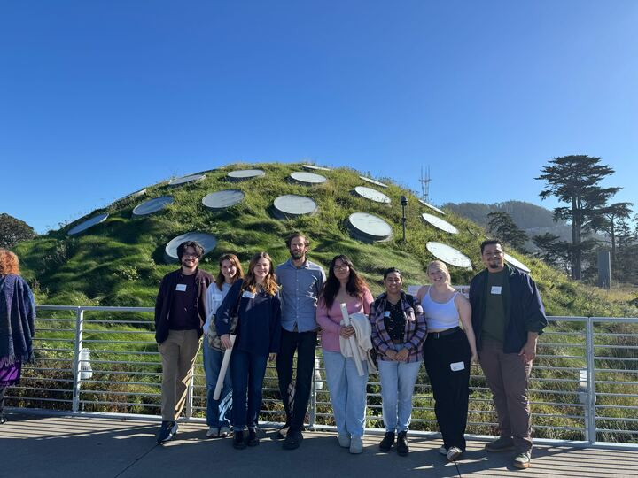

The MEEP lab had the great pleasure of visiting the California Academy of Sciences [**herbarium collection**](https://www.calacademy.org/scientists/botany-collections) in November! Our stellar tour guide, [**CAS Botanist Isaac Lichter-Marck**](https://www.calacademy.org/staff/ibss/botany/isaac-lichter-marck), gave us a peek behind the curtain of the sixth largest collection in the United States.

<figure>

  
  <figcaption>Living Roof MEEP selfie  
</figcaption>
</figure>

The MEEP Lab enjoyed meeting the botany staff at CAS; [**Ricardo Kriebel**](https://www.calacademy.org/staff/ibss/botany/ricardo-kriebel) shared his beautifully crafted botanical posters and was kind enough to give each member of the lab a copy to take home, thank you Ricardo! Read more about the Isaac and Ricardo [**here.**](https://www.calacademy.org/press/releases/the-california-academy-of-sciences-welcomes-two-new-botany-curators)

<figure>

  
  <figcaption>The MEEP Lab with CAS Botanist Isaac Lichter-Marck!  
</figcaption>left to right: Michael, Emma, Abbey, Isaac, Kaylee, Kanika, Paris, Josh
</figure>

Thank you Isaac, Ricardo and the phenomenal staff at California Academy of Sciences for letting the MEEP lab hang out for the day, until next time!

