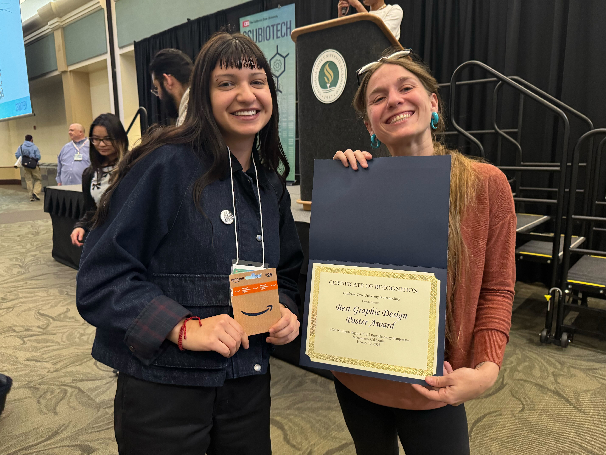
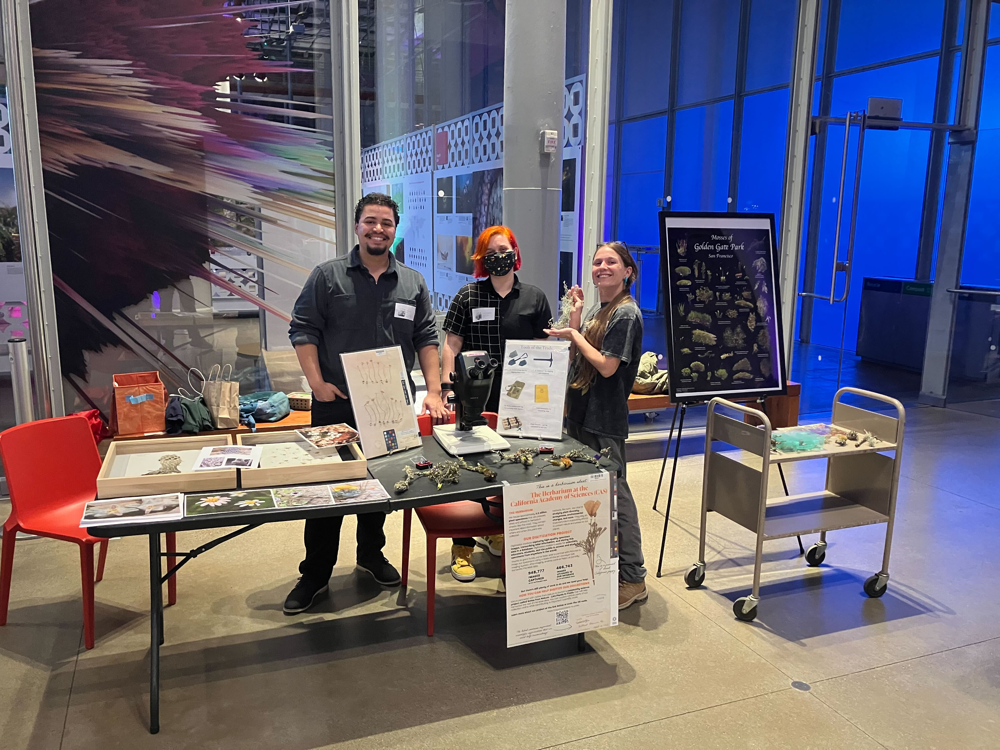

The members of the MEEP lab have had a busy year so far, read below to see what we have been up to! 

The lab had a successful run at the [**2026 CSU Biotech Conference.**](https://www.calstate.edu/impact-of-the-csu/research/csubiotech/symposium/Pages/Northern%20Regional%20Symposium-Program.aspx) Lab members Kaylee Macomb, Katrina McCollough and Abbey Schedler prepared posters; Katrina and Kaylee delivered fantastic talks for the poster session!

<figure>

  
  <figcaption>The MEEP lab at the CSU Biotech Conference in Sacramento, CA.
</figcaption>
</figure>

The lab took home multiple wins at CSU Biotech, including -
  Raffle winner Nio Gonzalez completed the tabling passport - networking champion!
  Abbey and Katrina's poster won the Best Graphic Design Poster Award!

<figure>

  
  <figcaption>Katrina and Nio displaying their wins!
</figcaption>
</figure>
  
Kaylee and Michael took on the [**Plant and Animal Genome Conference**](https://intlpag.org/PAG33/); they delivered fantastic poster presentations on their genomic projects! Kaylee is investigating the genus 𝑃𝑟𝑖𝑛𝑐𝑒𝑝𝑠 while Michael is looking at the 𝑁𝑜𝑟𝑣𝑒𝑔𝑖𝑐𝑎 genus.
  
  <figure>

  
  <figcaption>Kaylee at the Plant and Aninal Genome Conference (PAG) presenting her comparative genomics project on the insights into the U/V sexual system evolution.
</figcaption>
</figure>

The MEEP lab was invited to attend the "Tiny Nightlife" event at the California Academy of Science with special guest, [**tiny chef!**](https://www.calacademy.org/exhibits/tiny-chef-big-impact) Thank you to [**CAS Botanist Isaac Lichter-Marck**](https://www.calacademy.org/staff/ibss/botany/isaac-lichter-marck) for letting us join in on the fun. Lab members Joshua Harris, Frey Rogers and Katrina McCollough brought some moss and lichen samples to display and discuss at the event, creating a very popular herbarium display table!

<figure>

  
  <figcaption>Joshua, Frey and Katrina representing the herbarium table!
</figcaption>
</figure>

The MEEP lab has more exciting stops lined up for 2026, check back to see more!
