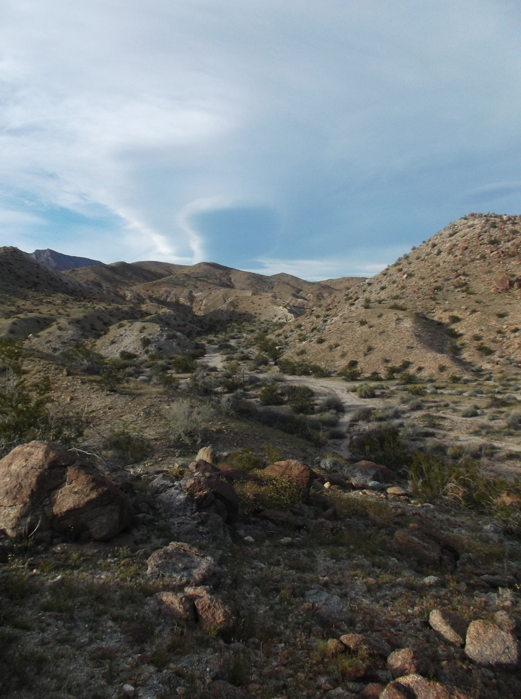
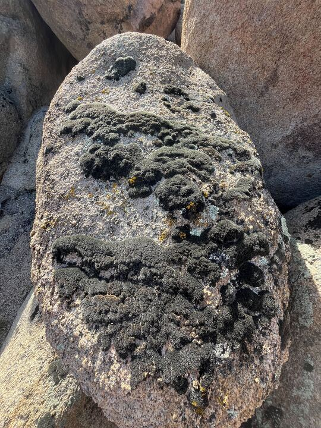
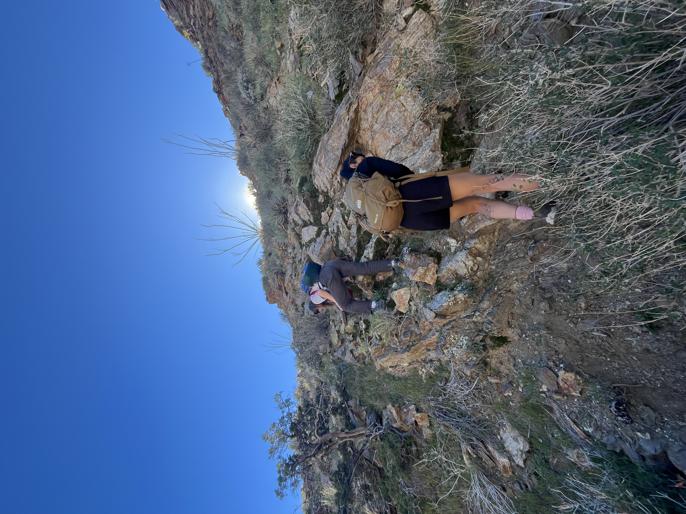
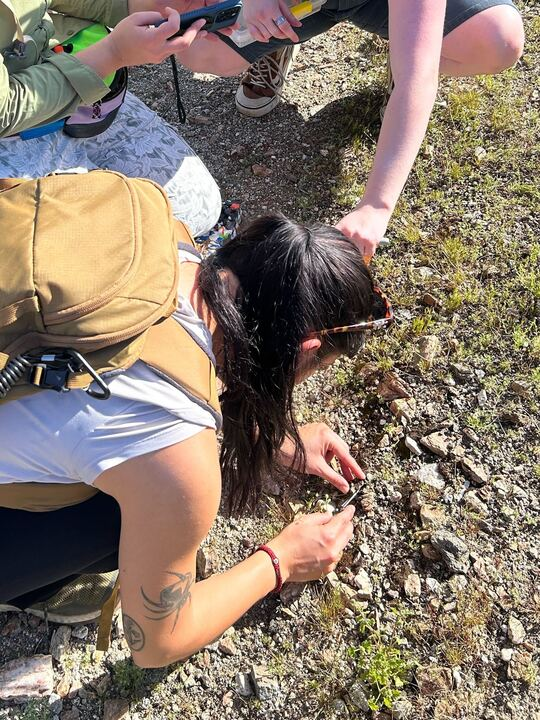

Five members of the MEEP lab took a trip to the Mojave and Colorado (Sonoran) Deserts to collect moss samples for the deserts project. This project spans field sites across the Great Basin, Mojave and Sonoran Deserts; stay tuned for updates on the research!

**See the bottom of this post for our iNaturalist project; help us out with identifying!**
  
This fieldwork supports the masters theses of Paris Hendershot and Kanika Kolpe, and the final project of post-bacc reseracher Abbey Schedler. Paris and Kanika are investigating physiological responses of *Syntrichia* mosses in extreme environments, read more about their projects [**here!**](https://meep-lab.com/project/physio/) Abbey is researching the microbiome of desert biocrusts, learn more [**here!**](https://meep-lab.com/project/microbio/)

<figure>

  
  <figcaption>The first spot we looked for samples At the Anza Borrego UC Reserve, no luck but beautiful!
</figcaption>
</figure>

Read below to hear from each project member about their favorite sights and experiences from the trip!

Grad students Paris Hendershot and Kanika Kolpe both enjoyed surveying an impressive array of moss covered boulders near the Burns Pinon UC reserve. Moss ID in the field can be tricky and part of the fun (and sometimes frustration) is the mystery of deciding a preliminary ID between two species that look very similar. In our case, *Grimmia* (not our target) and *Syntrichia,* (our target) were the cause of many mix-ups. The students on the deserts project became more familiar with the differences as the fieldwork progressed. Below our grad students highlight a typical case of what it's like to determine a preliminary moss ID in the field and how tricky it gets!

<figure>

  
  <figcaption> Kanika K - 'This is a photo of moss on a boulder. This type of moss which could be *Syntrichia*, does not grow on rocks; they grow on soil. While it is not apparent on this picture, there is a very thin patch of soil on this rock in which the moss is growing on. A *Syntrichia* spore could have landed on this small patch of soil and started growing. I find it fascinating that moss can thrive under such unusual circumstances that most plants would not be able to. My research is about how moss adapts to its environment and thrives. The ability to thrive on a thin patch of soil on a boulder in the middle of a desert is simply remarkable. I cannot wait to do more research on these moss and figure out exactly how they are able to survive in the deserts of California.'
</figcaption>
</figure>

<figure>

  
  <figcaption> Paris H - "This is a photo I took of some rock moss and lichen in the field at Burns Pinon Ridge Reserve. I found the location super interesting since this rock was in direct sunlight and moss tend to prefer shady areas. I also was amazed with how much moss was seen on this rock area! It really looks like a moss carpet…a very dried moss carpet that is. I will definitely be coming back to collect seasonally and observe these desert mosses in all their glory!"
</figcaption>
</figure>

Abbey and MEEP undergrad Nio Gonzalez rode the ultimate moss high when coming across a magnificent moss wall in Plum Canyon (Borrego Springs, CA). The two climbed the wall to collect the last bit of samples from the Sonoran Desert before the team moved on to the Mojave the next day.

<figure>

  
  <figcaption>Abbey and Nio scaling the side of this gorgeous moss wall. Abbey - "The element of verticality is not blatantly obvious from this photo, but the risk justified the reward to become one with the moss in this moment."
</figcaption>
</figure>
<figure>

Nio had a particular power for finding *Syntrichia* in unassuming places, see one example below!
<figure>

  
  <figcaption> Nio sampling target species *Syntrichia ruralis* with the team. Nio - "There is something really special about noticing the little things in a place as vast as the desert."
</figcaption>
</figure>
<figure>

<figure>

  
  <figcaption> Jenna and the crew taking in the view from the top of a hill at the Burns Pinon UC Reserve. 
</figcaption>
</figure>
<figure>

 

We documented all plants we saw with iNaturalist. Check out our field trip iNat project!

    

        
    

  
  <table class="inat-footer">
          
          
          
          
    <tr class="inat-user">
        <td class="inat-user-image">
          
        </td>
      <td class="inat-value">
        <strong>
            <a href="https://www.inaturalist.org/projects/meep-deserts-project?tab=observations">View all observations from our field trip »</a>
        </strong>
      </td>
    </tr>
  </table>

Thanks for tuning in to the MEEP blog!
