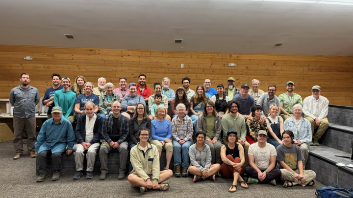
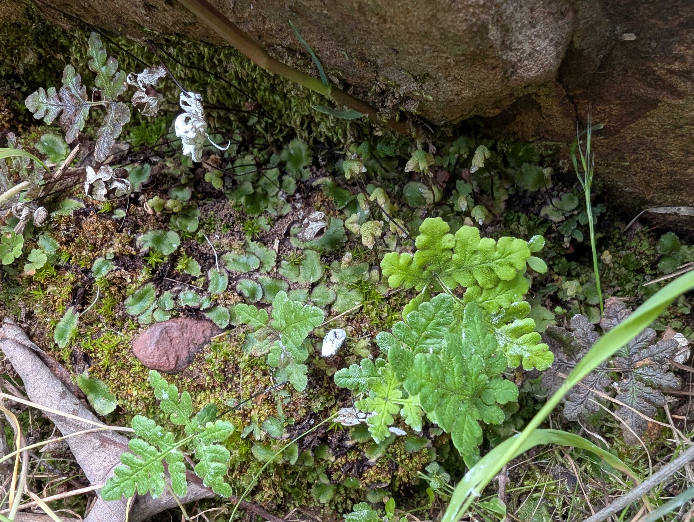
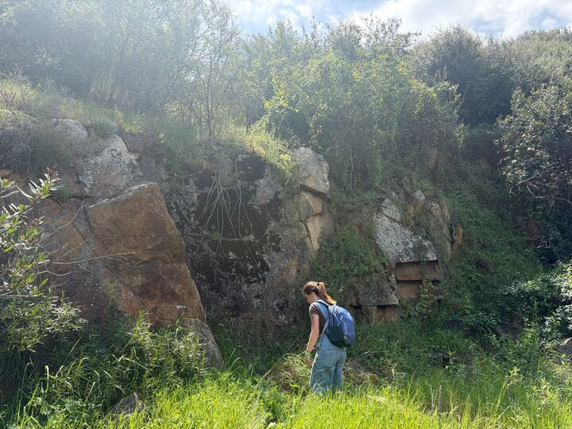

Four members of the MEEP lab attended the 30th annual [SO BE FREE](https://chapters.cnps.org/bryophyte/sobefree/) bryophyte foray in San Diego County this Spring, put on by the [California Native Plant Society Bryophyte chapter (CNPS).](https://chapters.cnps.org/bryophyte/) Read below to see how it went for Jenna, Abbey, Michael and Nio!

This foray is held annually in a different location throughout California to complete bryophyte surveys across a variety of habitats. This workshop brings bryologists and plant enthusiasts from across the Western US together for a weekend of hiking, bryophyte hunting, microscopy, and specimen identification olympics. Read about the history of SO BE FREE [here](https://chapters.cnps.org/bryophyte/sobefree/), and consider attending next year!! 

Congratulations are in order for our very own Dr. Jenna Ekwealor, or should we say, President Dr. Jenna Ekwealor!! Jenna was officially named the next president of the CNPS Bryophyte chapter at SO BE FREE. This was [Kirsten Fisher's](https://kfisherlab.weebly.com/people.html) last SBF as chapter president, who is sadly not pictured in the group photo below because she was taking it!

<figure>

  
  <figcaption> Attendees of the 30th annual CNPS Bryophyte chapter SO BE FREE
  </figcaption>
</figure>

We hiked in Mission Trails Regional Park to look for mosses, hornworts and liverworts; the hike was beautifully organized by CNPS Bryophyte chapter secretary, [Jake Bauer](https://www.inaturalist.org/people/jjbauer). This hike had a stunning bryophyte profile, see what we found below!

<figure>

  
  <figcaption> This is a liverwort, possibly [<i>Calasterella californica<i>](https://www.inaturalist.org/taxa/1612368-Calasterella-californica). Photo: Michael C. 
</figcaption>
</figure>

<figure>

  
  <figcaption> When stopped by a stream along the trail, this glowing beacon of hydrated [Bryaceae](https://www.inaturalist.org/taxa/67866-Bryaceae) moss caught our eye!. Photo: Abbey S.
</figcaption>
</figure>

<figure>

  
  <figcaption> Abbey stopped at a moss wall along the Mission Trails hike. Photo: Nio G.
</figcaption>
</figure>

That's all for now, until next year's SO BE FREE! Thanks for tuning in to the MEEP blog!
