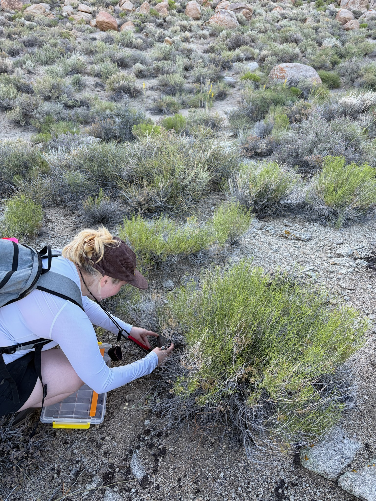
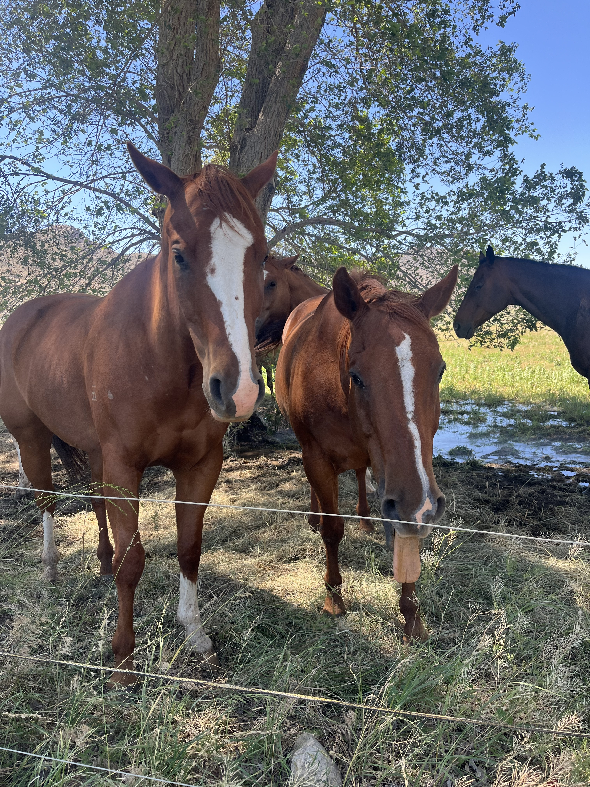
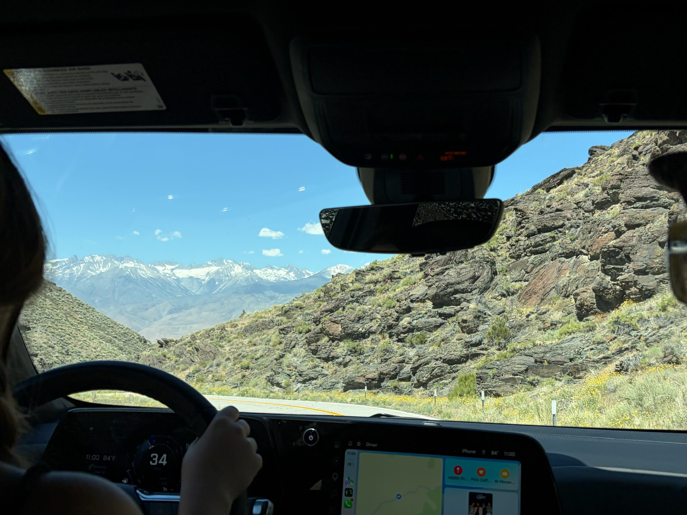

The deserts team (Abbey, Nio and Paris), visited the Great Basin desert to collect more samples for the ongoing project investigating *Syntrichia*  moss. It was a quick yet effective trip jam-packed with findings!

**See the bottom of this post for our iNaturalist project; help us out with identifying!**
  
This fieldwork supports the masters thesis of Paris Hendershot, and the final project of post-bac researcher Abbey Schedler. Paris is investigating physiological responses of *Syntrichia* mosses in extreme environments, read more about their projects [**here!**](https://meep-lab.com/project/physio/) Abbey is researching the microbiome of desert biocrusts, learn more [**here!**](https://meep-lab.com/project/microbio/)

<figure>

  
  <figcaption>
</figcaption>
</figure>

Our first stop was Deep Springs College, where we were once again hosted by the wonderful students and president Andrew Zink. Bright and early we found an abundance of our target genus Syntrichia and we were surrounded by beautiful soil crusts. Read below to hear from Paris about her favorite sights and experiences from the trip!

**Paris:**
In June, we had the privilege of spending a weekend in the Great Basin Desert. We stayed at a cute Airbnb in the town of Bishop, about an hour drive away from our collection site. Early Saturday morning, we started looking for moss at Deep Springs College. We hit the jackpot this trip! It was astonishing how much moss was around in this biocrust soil compared to other sites we had previously visited. Additionally, the lichen was stunning with extremely vibrant colors. Before we knew it, we had collected all the samples we needed from this site and were about to leave when we got to see the horses! We got out of our car just to stop and see them before heading back to Bishop. It was a great trip overall!

<figure>

  
  <figcaption>Paris collecting <i>Syntrichia</i> moss from patches surrounding a Yellow Rabbitbrush shrub <i>(Chrysothamnus viscidiflorus)<i>
</figcaption>
</figure>
<figure>

<figure>

  
  <figcaption> Friendly faces at Deep Springs College!
</figcaption>
</figure>
<figure>

<figure>

  
  <figcaption> The team taking in the beautiful view driving to Death Valley, CA.
</figcaption>
</figure>
<figure>

 

We documented all plants we saw with iNaturalist. Check out our field trip iNat project!

    

        
    

  
  <table class="inat-footer">
          
          
          
          
    <tr class="inat-user">
        <td class="inat-user-image">
          
        </td>
      <td class="inat-value">
        <strong>
            <a href="https://www.inaturalist.org/projects/meep-deserts-project?tab=observations">View all observations from our field trip »</a>
        </strong>
      </td>
    </tr>
  </table>

Thanks for tuning in to the MEEP blog!
