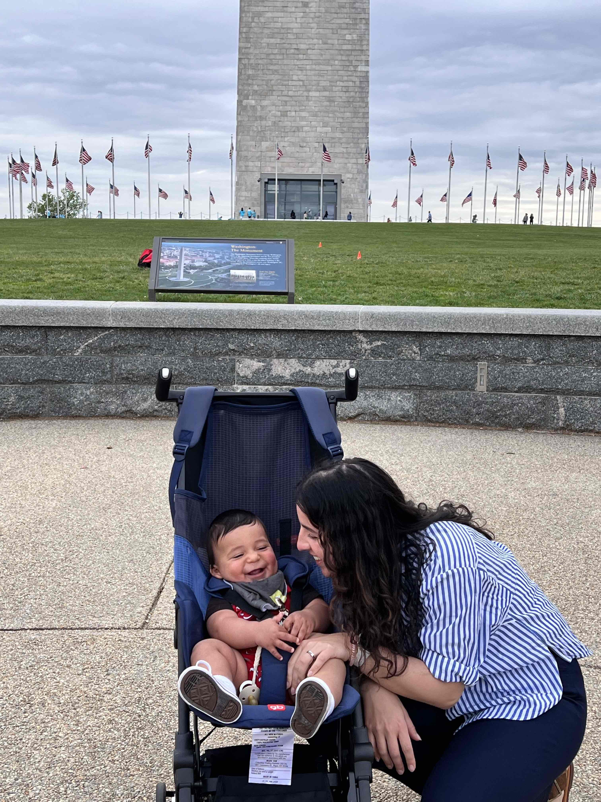
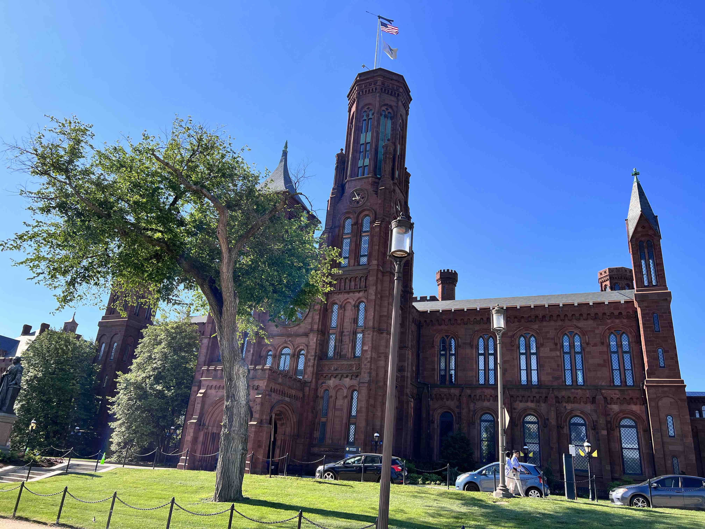
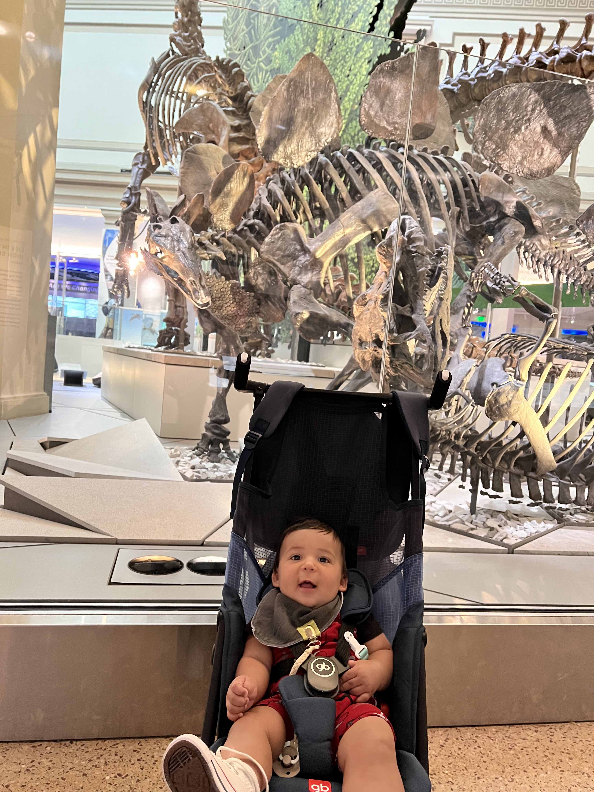
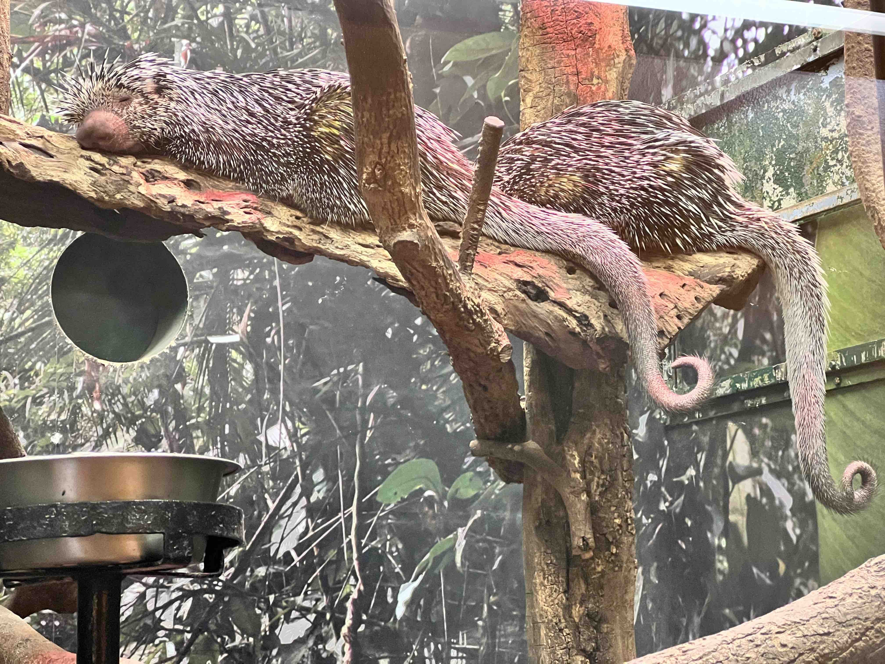
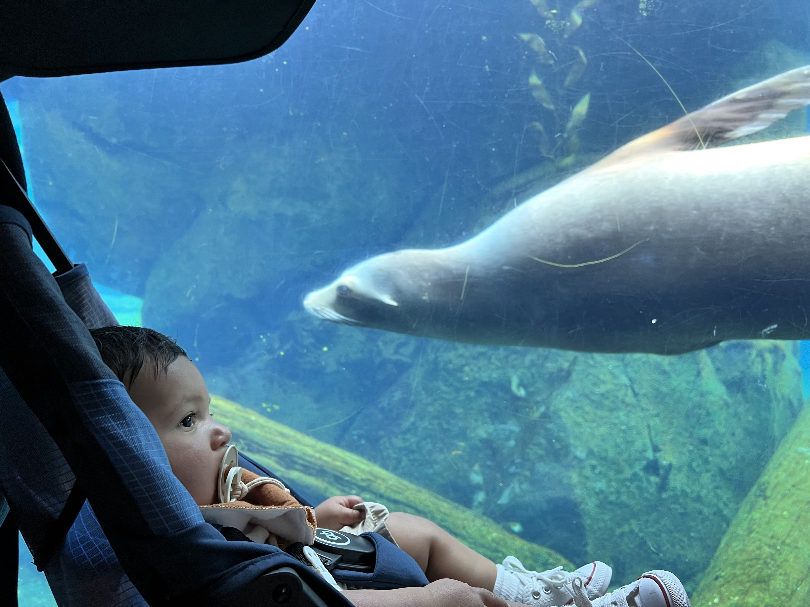
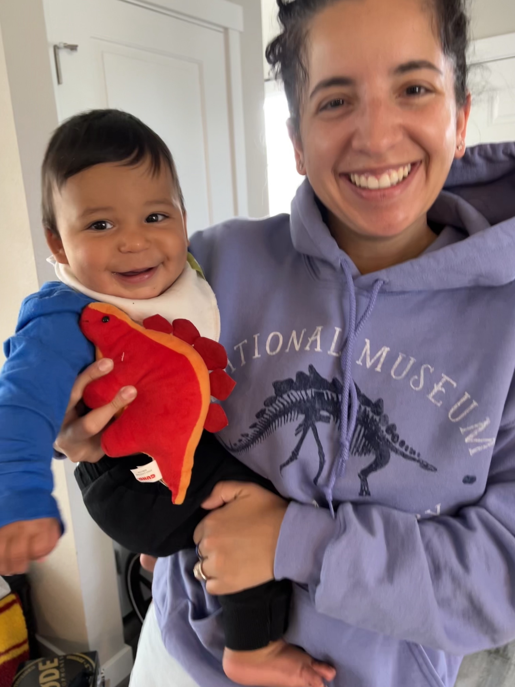

I went to D.C. to present in the <a href="https://naturalhistory.si.edu/research/botany/news-and-highlights/smithsonian-botanical-symposium" target="_blank">Smithsonian Botanical Symposium</a>, Life on the Edge: Exceptional Plants in Exceptional Place. See recordings of my talk and of the whole symposium <a href="https://www.jennaekwealor.com/talk/smithsonianbotsymp2022/"  target="_blank">here</a>. As I lived in Idaho at the time, this was a big travel! It was especially surreal as I had traveled so little the previous two years with the COVID-19 pandemic. My husband and 7-month-old came along for the trip, too! The symposium was fantastic as was working with the Data Science Lab in person. I had never actually been to the National Museum of Natural History before (and it had just recently reopened up its public exhibits), so it was a dream to be there. I had great conversations with the Symposium speakers, attendees, and organizers. I am so thankful for being invited to speak and to be able to visit. I can't wait to go back!

At the Washington Monument

The Smithsonian Castle

Baby with a Stegosaurus in the National Museum of Natural History

Porcupines with prehensile tails in the National Zoo

Baby looking at a seal in the National Zoo

Me and Baby with our Stegosaurus souvenirs

