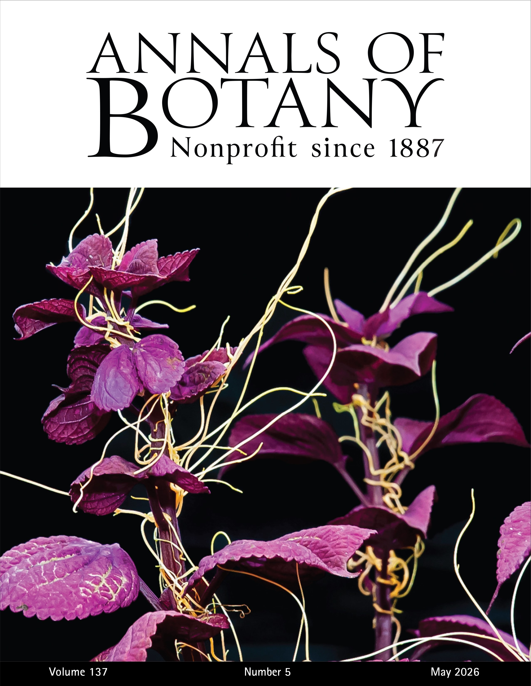
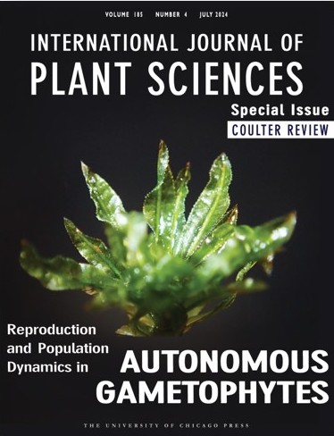

*Cover features:*
<a href="https://academic.oup.com/aob/issue/137/5#2537313-8417007" target="_blank">
<a href="https://www.journals.uchicago.edu/doi/10.1086/732133" target="_blank">IJPS</i> Coulter Review was featured on the cover of the July 2024 issue." width="210" style="display:inline-block;"/>
<a href="https://bsapubs.onlinelibrary.wiley.com/doi/epdf/10.1002/aps3.11424" target="_blank"> APPS </i> special issue <i>Methodologies in Gametophyte Biology</i>" width="210" style="display:inline-block;"/> 