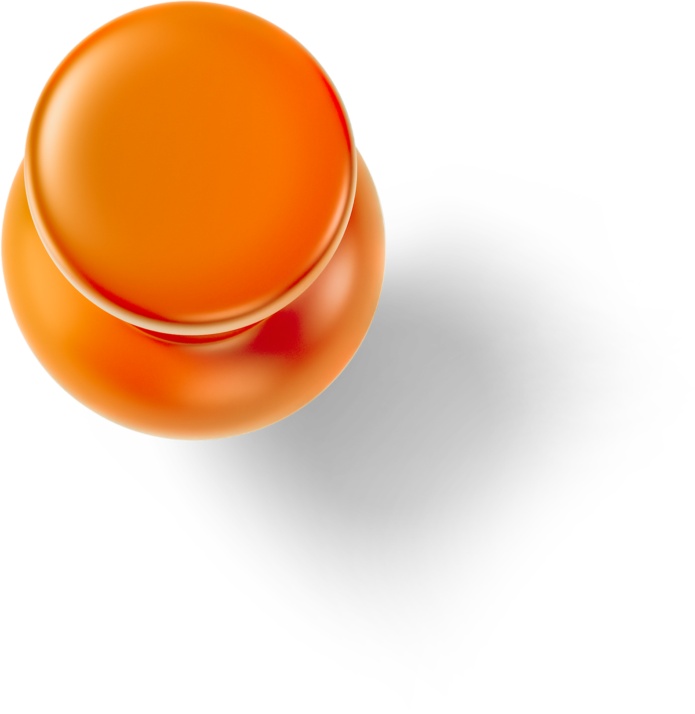

Lab Values

<h2>How we work together.</h2>

The MEEP Lab is built around community, collaboration, and curiosity. These values guide how we do science, how we support one another, and how we build a lab culture where people can grow as researchers, mentors, educators, scientists, and whole humans.

<h3>Community</h3>

We value a lab community where diverse voices are supported, heard, and valued. We aim to foster a welcoming environment where lab members feel a sense of belonging and are supported both within and beyond their time in the lab.

<h3>Collaboration</h3>

Collaboration is central to our science. Working together, sharing perspectives, and pooling expertise leads to better questions, stronger research, and more creative discoveries.

<h3>Curiosity</h3>

Curiosity drives our science. We embrace questioning, exploration, self-reflection, and growth, creating space for new ideas, thoughtful challenges, personal goals, and professional development.

These values are aspirational and require ongoing effort, humility, honesty, compassion, and communication. We work toward them together.

